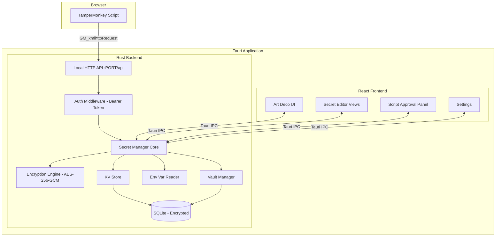
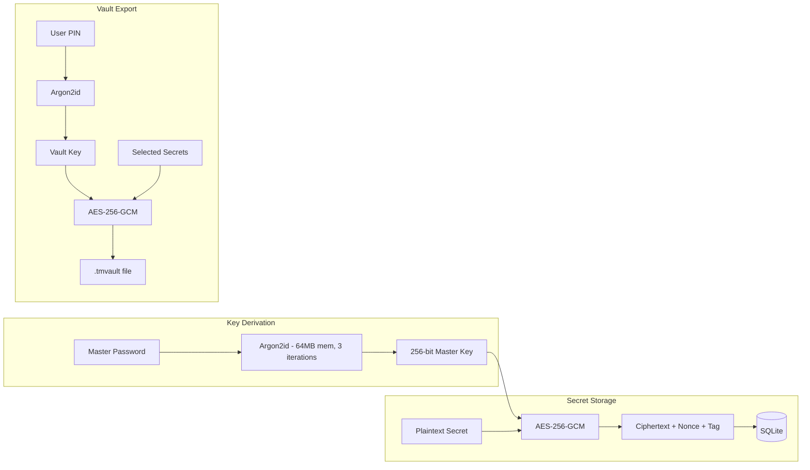
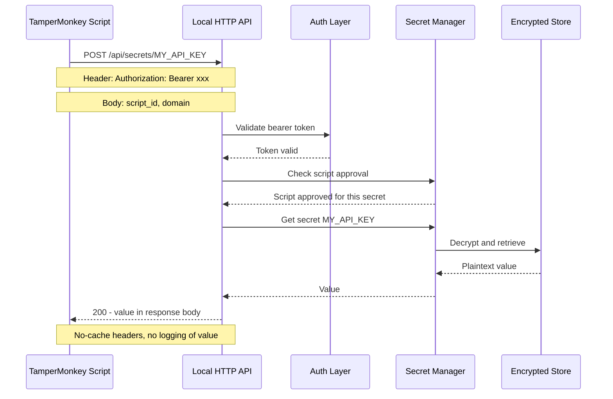
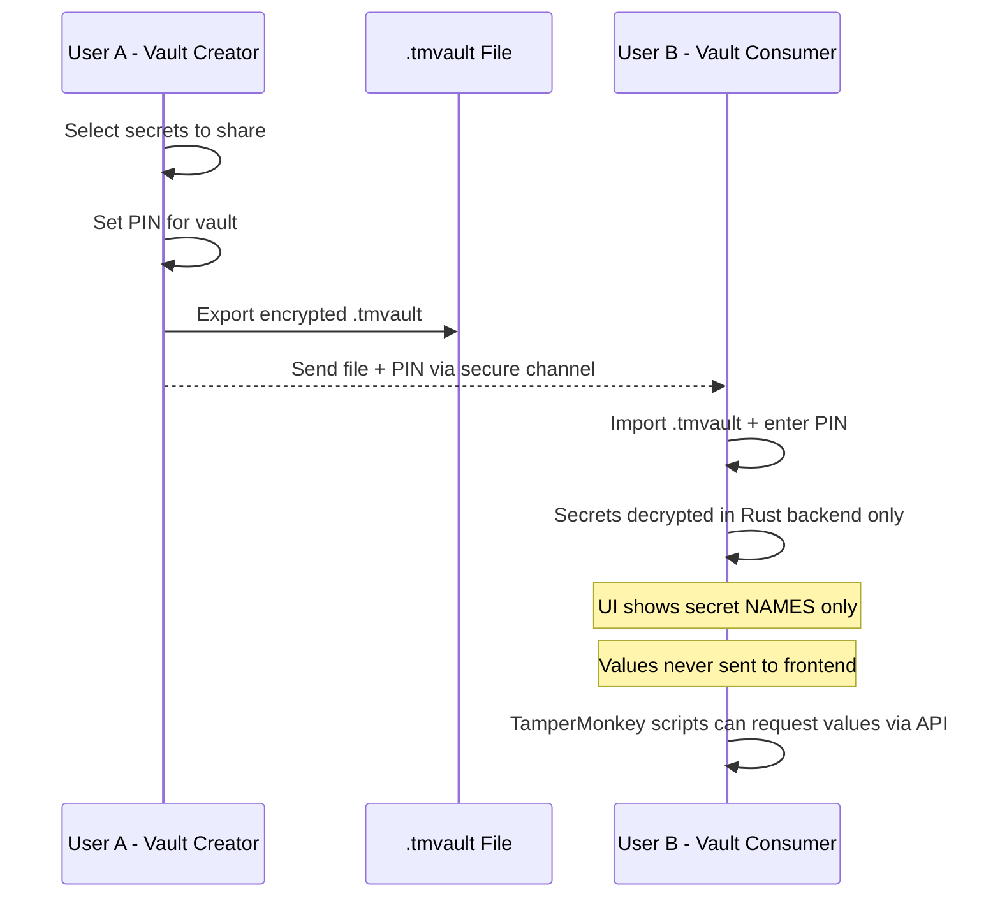

# TamperMonkey Secret Manager -- Architecture Plan

## Problem Statement

TamperMonkey has no native secret management. Users hardcode API keys, passwords, and tokens directly in userscripts, which are stored in plain text in browser storage. This app provides a secure bridge: a Tauri desktop application that stores secrets locally and serves them to TamperMonkey scripts via a local HTTP API.

---

## Tech Stack

| Layer | Technology | Rationale |
|-------|-----------|-----------|
| Desktop Framework | Tauri v2 | Rust backend for crypto; small binary; native OS integration |
| Frontend | React 18 + TypeScript | Modern UI with component architecture |
| Styling | Tailwind CSS + CSS custom properties | Art Deco theme with light/dark mode |
| State Management | Zustand | Lightweight, minimal boilerplate |
| Encryption | `ring` or `aes-gcm` + `argon2` crates | Audited Rust crypto libraries |
| Local API Server | `axum` (embedded in Tauri) | High-performance async HTTP in Rust |
| Storage | SQLite via `rusqlite` | Encrypted at rest; single file vault |
| Build | Vite | Fast dev server and builds |

---

## System Architecture



---

## Secret Types

### 1. Key-Value Pairs
- User-defined name/value pairs stored in SQLite
- Values encrypted with AES-256-GCM before storage
- Master key derived from app password via Argon2id

### 2. Environment Variables
- User configures an allowlist of env var names
- Values read from OS at runtime -- never persisted to disk
- Allowlist stored in config; actual values stay in memory only

### 3. Encrypted Vault Files -- Shareable Blind Vaults
- Portable `.tmvault` files encrypted with AES-256-GCM
- Key derived from user-supplied PIN via Argon2id
- Can be shared between users
- Recipient can USE secrets without SEEING them in the UI

---

## Encryption Strategy



| Parameter | Value |
|-----------|-------|
| Algorithm | AES-256-GCM |
| KDF | Argon2id |
| Argon2 memory | 64 MB |
| Argon2 iterations | 3 |
| Argon2 parallelism | 1 |
| Salt length | 16 bytes (random per key) |
| Nonce length | 12 bytes (random per encryption) |
| Master key length | 256 bits |

---

## Local HTTP API Design

### Startup
- API server binds to `127.0.0.1` on a random available port
- Port number saved to a well-known file: `%APPDATA%/tampermonkey-secrets/api.port`
- TamperMonkey helper snippet reads port file to connect

### Authentication
- On first launch, a cryptographically random bearer token is generated
- Token stored in: `%APPDATA%/tampermonkey-secrets/api.token`
- Every request must include `Authorization: Bearer <token>`
- Token rotates on each app restart (configurable)

### Endpoints

| Method | Path | Description |
|--------|------|-------------|
| GET | `/api/health` | Health check, no auth required |
| POST | `/api/secrets/:name` | Retrieve a secret by name |
| POST | `/api/register` | Script self-registration |
| GET | `/api/scripts` | List registered scripts (UI only) |

### Request/Response Flow



---

## Script Registration and Approval

1. TamperMonkey script sends `POST /api/register` with its name, matching domains, and requested secret names
2. Tauri app shows a notification/popup: *Script X wants access to secrets: Y, Z*
3. User approves or denies in the UI
4. Approval stored in SQLite (script_id -> allowed_secrets mapping)
5. Future requests checked against approval table

### Script Identity
- Scripts identify via a `script_id` field (typically `@name` + `@namespace` from the userscript header)
- This is **trust-on-first-use** -- a malicious script could spoof an ID
- The bearer token is the primary security gate; script approval is a secondary layer

---

## Blind Vault Sharing



### Blind Mode Implementation
- Vault metadata includes a `blind: true` flag per-secret
- When `blind: true`, the Tauri IPC handler **refuses** to send the value to the frontend
- Only the HTTP API path can serve the value (to TamperMonkey)
- User B can add their own (non-blind) secrets alongside imported blind ones

---

## Threat Model

| Threat | Mitigation | Residual Risk |
|--------|-----------|---------------|
| Secrets in plain text in scripts | Entire point of this app -- secrets fetched at runtime | None if scripts updated |
| Bearer token theft | Token file has restrictive OS permissions; rotates on restart | Local admin access could read it |
| Malicious TamperMonkey script | Script approval system; bearer token required | Spoofed script_id after token compromise |
| Memory scraping | Secrets decrypted only momentarily; Rust manages memory | Sophisticated local malware could still read process memory |
| Vault file brute force | Argon2id with high memory cost makes brute force expensive | Weak PINs are still weak -- enforce minimum complexity |
| Network sniffing localhost | 127.0.0.1 binding; traffic never leaves loopback | Local packet capture tools on compromised machine |
| .gitignore failure | Vault files, tokens, keys all in %APPDATA% not project dir | Accidental commit of dev config |
| Supply chain attack | Pin dependency versions; audit crate choices | Upstream compromise |
| Frontend XSS leaking secrets | Blind secrets never reach frontend; CSP headers | Non-blind secrets visible in React state |
| Clipboard attacks | No clipboard involvement in API flow | N/A |

---

## UI/UX Design -- Art Deco Theme

### Color Palette

| Role | Light Mode | Dark Mode |
|------|-----------|-----------|
| Background | `#FAFAF5` warm white | `#1A1A2E` deep navy-black |
| Surface | `#FFFFFF` | `#16213E` |
| Primary / Accent | `#C9A84C` antique gold | `#D4AF37` bright gold |
| Primary Hover | `#B8963A` | `#E5C158` |
| Text Primary | `#1A1A2E` | `#F5F5F0` |
| Text Secondary | `#6B6B6B` | `#A0A0A0` |
| Border | `#D4AF37` gold hairline | `#C9A84C` muted gold |
| Danger | `#8B2500` deep red | `#FF4444` |
| Success | `#2E5A2E` | `#4CAF50` |

### Design Elements
- **Typography**: Geometric sans-serif (e.g., `Outfit` or `DM Sans`) for body; `Playfair Display` for headings
- **Borders**: Thin gold hairlines, stepped/layered corner accents
- **Decorative motifs**: Chevron patterns, sunburst dividers, fan shapes as CSS pseudo-elements
- **Cards**: Subtle gold border with chamfered/clipped corners (CSS `clip-path`)
- **Buttons**: Gold gradient backgrounds with geometric hover animations
- **Icons**: Lucide React -- clean geometric line icons that fit Art Deco aesthetic
- **Layout**: Symmetrical, centered, generous whitespace -- Art Deco favors order and geometry

### Key Views

1. **Unlock Screen** -- Master password entry; large sunburst logo
2. **Dashboard** -- Overview of secret counts by type, recent access log
3. **Secrets Manager** -- CRUD for KV pairs; env var allowlist; vault import/export
4. **Script Approvals** -- List of registered scripts with approve/revoke controls
5. **Settings** -- API port config, token rotation, theme toggle, PIN complexity rules

---

## .gitignore Strategy

```
# Dependencies
node_modules/

# Build output
dist/
target/
src-tauri/target/

# Environment and secrets -- CRITICAL
*.tmvault
*.key
*.pem
*.token
api.port
api.token

# App data that might be copied to project during dev
*.db
*.db-journal
*.sqlite

# IDE
.vscode/
.idea/

# OS
.DS_Store
Thumbs.db

# Tauri
src-tauri/WixTools/
src-tauri/gen/

# Test artifacts
*.test.vault
*.test.db

# Logs
*.log
```

---

## Project Structure

```
tampermonkey-secret-manager/
+-- src/                          # React frontend
|   +-- assets/                   # Fonts, SVG decorations
|   +-- components/
|   |   +-- ui/                   # Base components: Button, Card, Input, Modal
|   |   +-- layout/               # Shell, Sidebar, Header
|   |   +-- secrets/              # SecretList, SecretEditor, EnvVarConfig
|   |   +-- scripts/              # ScriptApprovalList, ScriptDetail
|   |   +-- vault/                # VaultImport, VaultExport
|   +-- hooks/                    # useSecrets, useScripts, useTheme
|   +-- stores/                   # Zustand stores
|   +-- lib/                      # Tauri IPC wrappers, API helpers
|   +-- theme/                    # Art Deco theme tokens, Tailwind config
|   +-- views/                    # Page-level components
|   +-- App.tsx
|   +-- main.tsx
+-- src-tauri/
|   +-- src/
|   |   +-- main.rs               # Tauri entry point
|   |   +-- api/                   # Axum HTTP server
|   |   |   +-- mod.rs
|   |   |   +-- routes.rs
|   |   |   +-- auth.rs           # Bearer token middleware
|   |   +-- crypto/
|   |   |   +-- mod.rs
|   |   |   +-- encryption.rs     # AES-256-GCM operations
|   |   |   +-- kdf.rs            # Argon2id key derivation
|   |   +-- secrets/
|   |   |   +-- mod.rs
|   |   |   +-- kv.rs             # Key-value secret store
|   |   |   +-- env.rs            # Environment variable reader
|   |   |   +-- vault.rs          # Vault file import/export
|   |   +-- db/
|   |   |   +-- mod.rs
|   |   |   +-- models.rs
|   |   |   +-- migrations.rs
|   |   +-- commands.rs            # Tauri IPC command handlers
|   |   +-- state.rs               # App state management
|   |   +-- error.rs               # Error types
|   +-- Cargo.toml
|   +-- tauri.conf.json
+-- plans/                         # Architecture docs
+-- package.json
+-- tsconfig.json
+-- tailwind.config.ts
+-- vite.config.ts
+-- .gitignore
```

---

## TamperMonkey Helper Snippet

A small JS snippet users paste into their TamperMonkey scripts:

```javascript
// ==UserScript==
// @name         My Script
// @grant        GM_xmlhttpRequest
// ==/UserScript==

async function getSecret(name) {
    const PORT = 12345;  // Read from known location or hardcode after setup
    const TOKEN = 'xxx'; // User copies from app settings

    return new Promise((resolve, reject) => {
        GM_xmlhttpRequest({
            method: 'POST',
            url: `http://127.0.0.1:${PORT}/api/secrets/${name}`,
            headers: {
                'Authorization': `Bearer ${TOKEN}`,
                'Content-Type': 'application/json'
            },
            data: JSON.stringify({
                script_id: GM_info.script.name,
                domain: window.location.hostname
            }),
            onload: (res) => resolve(res.responseText),
            onerror: (err) => reject(err)
        });
    });
}

// Usage:
const apiKey = await getSecret('MY_API_KEY');
```

---

## Implementation Phases

### Phase 1 -- Foundation
- Tauri v2 project scaffold with React + TypeScript + Vite
- Rust crypto module (AES-256-GCM, Argon2id)
- SQLite setup with encrypted secret storage
- Master password unlock flow
- Basic KV secret CRUD via Tauri IPC

### Phase 2 -- Local HTTP API
- Axum server embedded in Tauri
- Bearer token generation and file storage
- Secret retrieval endpoint
- Script registration and approval system

### Phase 3 -- All Secret Types
- Environment variable allowlist and runtime reading
- Vault file export/import (.tmvault format)
- Blind mode for shared vault secrets

### Phase 4 -- UI Polish
- Art Deco theme implementation (light/dark)
- Dashboard with access logs
- Settings panel
- TamperMonkey helper snippet copy-to-clipboard

### Phase 5 -- Security Hardening
- Comprehensive .gitignore
- Tauri CSP configuration
- Token rotation
- Audit logging
- OS-level file permissions on sensitive files
- Integration tests for crypto paths

### Phase 6 -- Packaging and Distribution
- Windows installer via Tauri bundler
- Auto-update configuration
- First-run onboarding wizard

### Phase 7 -- Threat Modeling and Security Review
- Formal STRIDE threat analysis across all components (Spoofing, Tampering, Repudiation, Information Disclosure, Denial of Service, Elevation of Privilege)
- Attack surface enumeration: Tauri IPC commands, HTTP API endpoints, file system artifacts, process memory
- Adversarial testing: bearer token theft simulation, vault PIN brute force, script ID spoofing
- Data flow review: trace every path a secret value travels, verify no unintended leakage
- Blind mode bypass audit: confirm no IPC command, API endpoint, or log statement can expose blind values to the frontend
- Tauri IPC command surface review: ensure no over-exposed commands that could be called from webview JS
- Dependency audit: scan all Rust crates and npm packages for known CVEs (cargo-audit, npm audit)
- Pin all dependency versions and verify lock file integrity
- Document all residual risks with severity ratings and accepted trade-offs
- Incident response playbook: steps for token compromise, vault file leak, and dependency vulnerability scenarios
- Prepare documentation for potential third-party security review
