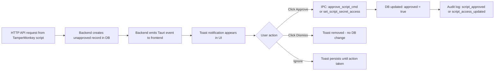
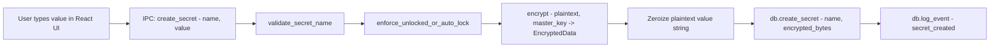
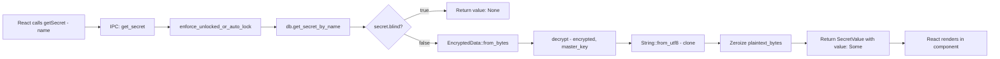
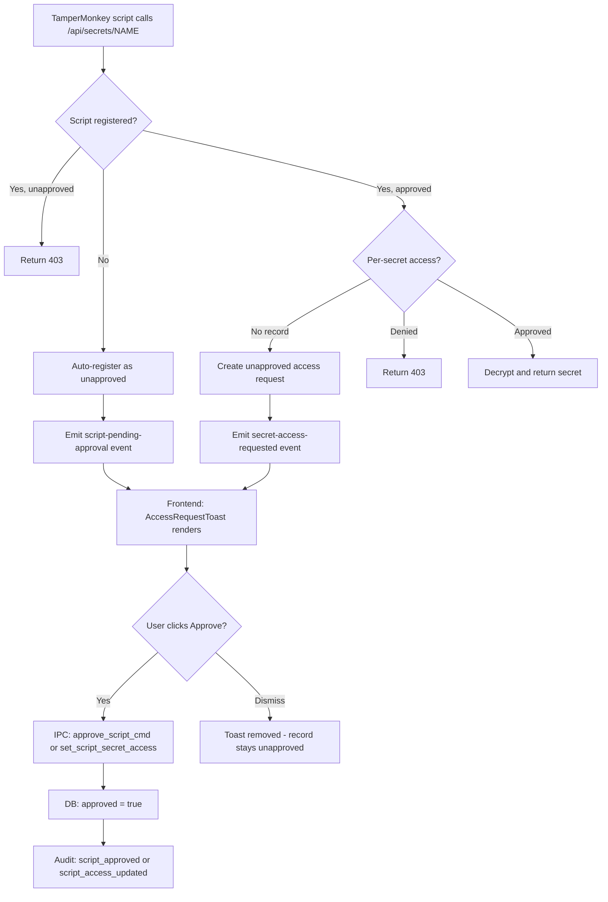
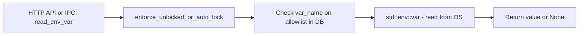
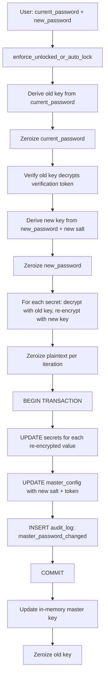

# TamperMonkey Secret Manager -- Security Review (Phase 7, Update 2)

**Document Version**: 2.0  
**Date**: 2026-03-19  
**Previous Version**: 1.0 (2026-03-12)  
**Scope**: Full STRIDE threat analysis, attack surface enumeration, data flow review, residual risk assessment, and **security assessment of recent changes** (token persistence, fixed port, Tauri event emission, one-click toast approval, AppHandle in shared state).

---

## Table of Contents

1. [Recent Changes -- Security Assessment](#1-recent-changes----security-assessment)
2. [STRIDE Threat Analysis](#2-stride-threat-analysis)
3. [Attack Surface Enumeration](#3-attack-surface-enumeration)
4. [Data Flow Analysis](#4-data-flow-analysis)
5. [Blind Mode Bypass Audit](#5-blind-mode-bypass-audit)
6. [Dependency Audit](#6-dependency-audit)
7. [Residual Risk Register](#7-residual-risk-register)
8. [Incident Response Playbook](#8-incident-response-playbook)
9. [Recommendations for Future Improvement](#9-recommendations-for-future-improvement)
10. [Overall Security Posture Assessment](#10-overall-security-posture-assessment)

---

## 1. Recent Changes -- Security Assessment

This section evaluates five recent changes to the application and their impact on the security posture. Each finding has a risk rating and specific recommendations.

### 1.1 Bearer Token Persistence Across Launches

**Change**: The bearer token is now reused across application restarts. On first launch (or after explicit rotation via [`rotate_api_token`](../src-tauri/src/commands.rs:1319)), a new token is generated and saved to `{app_data_dir}/tampermonkey-secrets/api.token`. On subsequent launches, [`load_token()`](../src-tauri/src/api/auth.rs:39) reads the existing token from disk.

**Previous behavior**: Token was regenerated every launch, requiring TamperMonkey scripts to be reconfigured each restart.

**Risk Rating**: **Medium**

**Analysis**:

| Aspect | Per-Launch Rotation (old) | Persistent Token (new) |
|--------|--------------------------|----------------------|
| Token lifetime | Minutes to hours | Indefinite until explicit rotation |
| Exposure window | Narrow | Wide -- compromise persists across restarts |
| UX friction | High -- reconfigure scripts every restart | Low -- configure once |
| File system exposure | Token file overwritten each launch | Token file is long-lived and a static target |
| Incident recovery | Restart clears compromised token | Must explicitly call rotate_api_token |

**Specific risks introduced**:

1. **Longer compromise window**: A stolen token remains valid until the user explicitly rotates it. Previously, restarting the app was sufficient to invalidate a compromised token.

2. **Token file becomes higher-value target**: The `api.token` file now represents a persistent credential rather than an ephemeral one. Malware that reads the file once gains indefinite access.

3. **No automatic token age enforcement**: There is no mechanism to auto-rotate the token after N days. A token could persist for months without rotation.

**Mitigating factors**:

- File is protected by icacls (current user read/write only) via [`set_owner_only_permissions()`](../src-tauri/src/api/auth.rs:119)
- Two-layer authorization still applies -- token only passes the auth gate; per-script + per-secret checks still enforced
- User can manually rotate via the UI at any time
- Rate limiting still constrains brute-force attempts

**Recommendations**:

| # | Recommendation | Priority |
|---|---------------|----------|
| 1.1a | Add optional **auto-rotation schedule** (e.g., rotate token on first launch after N days since last rotation). Log `api_token_auto_rotated` to audit. | Medium |
| 1.1b | Display **token age** in the Settings UI so users can see how long the current token has been active. | Low |
| 1.1c | On [`rotate_api_token`](../src-tauri/src/commands.rs:1319), also **zeroize the old token in the file** before writing the new one (currently `fs::write` overwrites, but the old data may linger in file system journal/slack space). | Low |
| 1.1d | Log a **warning event** if the token has not been rotated in >30 days, visible in the audit log. | Low |

---

### 1.2 Fixed Default Port (17179)

**Change**: The API server now binds to port **17179** by default ([`DEFAULT_PORT`](../src-tauri/src/api/server.rs:23)). If busy, falls back to a random OS-assigned port ([`server.rs:116`](../src-tauri/src/api/server.rs:116)).

**Previous behavior**: Always bound to a random port (`SocketAddr::from(([127, 0, 0, 1], 0u16))`).

**Risk Rating**: **Low**

**Analysis**:

| Attack Vector | Random Port (old) | Fixed Port (new) |
|--------------|------------------|-----------------|
| Port scanning required? | Yes -- attacker must scan localhost | No -- port is known |
| Port pre-binding attack | Unlikely (random target) | Possible -- malware binds 17179 before app starts to intercept |
| Firewall rules | Hard to whitelist | Easy to whitelist specifically |
| Script configuration | Must read api.port file each launch | Can hardcode port in scripts |

**Specific risks introduced**:

1. **Port squatting / pre-binding attack**: Malware could bind to port 17179 before the application starts, creating a rogue server that collects bearer tokens from TamperMonkey scripts. The scripts would send their `Authorization: Bearer <token>` header to the malicious server. The app would silently fall back to a random port and the scripts would fail.

   - **Severity**: Medium (requires malware on the system that runs before the app)
   - **Likelihood**: Low (targeted attack on this specific application)
   - **Mitigation**: TamperMonkey scripts should verify the response includes expected fields. The `api.port` file always reflects the actual port, so scripts reading this file would connect correctly. Pre-binding attack only affects scripts with hardcoded ports.

2. **Local enumeration**: Any process on the machine can probe `127.0.0.1:17179` to determine if the secret manager is running. With a random port, this required scanning.

   - **Severity**: Low (informational disclosure only -- running status)
   - **Mitigation**: The `/api/health` endpoint already responds without auth, so detection was always possible; a known port just makes it trivial.

**Mitigating factors**:

- Bearer token is still required for all non-health endpoints
- `127.0.0.1` binding prevents external network access
- Fallback to random port provides resilience
- Rate limiting applies to all endpoints including health

**Recommendations**:

| # | Recommendation | Priority |
|---|---------------|----------|
| 1.2a | **Document the port-squatting risk** in user-facing docs. Advise scripts to read `api.port` file rather than hardcoding 17179. | Medium |
| 1.2b | On startup, if fallback to random port occurs, **emit a warning event** to the frontend (e.g., "Another process is using port 17179 -- using fallback port"). This alerts users to potential port squatting. | Medium |
| 1.2c | Consider adding a **server identity verification** mechanism: the health endpoint could return a signed nonce or a hash derived from the bearer token, allowing scripts to verify they are talking to the real server without revealing the token. | Low |

---

### 1.3 Tauri Event Emission from API Routes

**Change**: The HTTP API server now emits Tauri events to the frontend via the [`AppHandle`](../src-tauri/src/state.rs:34) stored in `AppState`. Two events are emitted:

- **`secret-access-requested`** with payload [`AccessRequestEvent`](../src-tauri/src/api/routes.rs:18): `{ script_id, script_name, secret_name }`
- **`script-pending-approval`** with payload [`ScriptPendingEvent`](../src-tauri/src/api/routes.rs:27): `{ script_id, script_name, domain }`

**Risk Rating**: **Low**

**Analysis of event payloads**:

| Field | Sensitive? | Assessment |
|-------|-----------|------------|
| `script_id` | No | Self-reported identifier; already stored in DB |
| `script_name` | No | Self-reported name; already stored in DB |
| `secret_name` | **Marginal** | Reveals that a secret with this name exists; however, the frontend already has access to the full secret list via [`list_secrets`](../src-tauri/src/commands.rs:693) |
| `domain` | No | The domain the script runs on; already stored in DB |

**Specific risks evaluated**:

1. **Secret name disclosure via event**: The `secret_name` field in [`AccessRequestEvent`](../src-tauri/src/api/routes.rs:18) confirms the existence of a specific secret. However, this information is already available to the frontend via the [`list_secrets`](../src-tauri/src/commands.rs:693) IPC command. The event does not expose secret *values*.

2. **Event injection**: Could an attacker inject fake Tauri events to trigger social-engineering toasts? No -- [`handle.emit()`](../src-tauri/src/api/routes.rs:225) is called from Rust backend code, not from untrusted input. The Tauri event system is internal to the process.

3. **Information leakage to other windows**: Tauri events emitted via [`emit()`](../src-tauri/src/api/routes.rs:185) broadcast to all windows. Since the app has only one window ([`tauri.conf.json`](../src-tauri/tauri.conf.json:14)), this is not a concern.

4. **No secret values in payloads**: Neither event includes the actual secret value, decrypted or otherwise. The payloads contain only metadata that is already visible in the frontend's script management UI.

**Conclusion**: The event payloads do **not** leak sensitive data. They contain only metadata (script identity, secret names, domains) that the frontend already has access to through existing IPC commands.

**Recommendations**:

| # | Recommendation | Priority |
|---|---------------|----------|
| 1.3a | No changes needed. Current payloads are appropriately scoped. | N/A |
| 1.3b | If future events carry more sensitive data, use [`emit_to()`](https://docs.rs/tauri/latest/tauri/struct.AppHandle.html#method.emit_to) targeting only the main window label instead of broadcasting to all windows. | Info |

---

### 1.4 Frontend Toast with One-Click Approve

**Change**: [`AccessRequestToast.tsx`](../src/components/ui/AccessRequestToast.tsx:51) renders floating toast notifications for approval requests. Users can approve script registrations and secret access with a single click on the "Approve" button.

**Risk Rating**: **Medium**

**Analysis of approval flow**:

**Specific risks evaluated**:

1. **Accidental approval via rapid clicking**: If a user is actively clicking in the bottom-right area of the screen when a toast appears, they could inadvertently hit "Approve." The toast has a small approve button (`px-3 py-1.5`) positioned in the lower-right corner of the screen ([`AccessRequestToast.tsx:151`](../src/components/ui/AccessRequestToast.tsx:151)).

   - **Severity**: Medium -- grants a script persistent access to secrets
   - **Likelihood**: Low -- requires precise timing of user click and toast appearance
   - **Mitigation**: Toast uses `animate-slide-up` animation, providing visual notice. The approve button is small and requires deliberate targeting.

2. **Social engineering via toast flooding**: A malicious script could rapidly call the API with different `script_id` values to flood the UI with pending approval toasts, hoping the user approves some in frustration.

   - **Severity**: Medium -- could trick user into approving a malicious script
   - **Likelihood**: Low -- rate limiting (60 req/min) constrains the flood rate. Duplicate key suppression in [`AccessRequestToast.tsx:65`](../src/components/ui/AccessRequestToast.tsx:65) prevents duplicate toasts for the same script+secret pair.
   - **Mitigation**: Rate limiter, duplicate suppression, explicit dismiss button

3. **Clickjacking**: In a traditional web context, clickjacking overlays a transparent iframe to trick users into clicking. In a Tauri desktop app, the webview is not embeddable in an iframe by external sites. The CSP in [`tauri.conf.json`](../src-tauri/tauri.conf.json:24) restricts `default-src` to `'self'`, preventing external frame embedding.

   - **Severity**: N/A -- not applicable to Tauri desktop apps
   - **Mitigation**: Tauri's webview architecture prevents this attack vector entirely

4. **No confirmation dialog**: The approval is a single-click action with no "Are you sure?" confirmation. While this is a deliberate UX choice for low-friction workflows, high-value secrets could be accidentally exposed.

   - **Severity**: Low -- the user still controls which secrets are blind and which scripts exist
   - **Mitigation**: Approval can be revoked via the Scripts management UI

5. **Dismiss does not deny**: Clicking "Dismiss" only removes the toast from the UI. It does not mark the access request as denied in the database -- the unapproved record persists, and the toast will not reappear (because the DB record already exists). This means the script will continue to get 403 on subsequent attempts, which is correct behavior.

**Recommendations**:

| # | Recommendation | Priority |
|---|---------------|----------|
| 1.4a | Add a **configurable "confirm before approve" option** in Settings. When enabled, clicking Approve shows a brief confirmation dialog: "Grant [script_name] access to [secret_name]?" | Medium |
| 1.4b | Add an **approval cooldown**: after a toast appears, the Approve button should be **disabled for 2-3 seconds** to prevent accidental clicks from users who were clicking rapidly when the toast appeared. | Medium |
| 1.4c | Show the **number of pending approvals** somewhere persistent (e.g., a badge in the sidebar) so dismissed toasts can be revisited from the Scripts management page. | Low |
| 1.4d | Consider a **maximum concurrent toast limit** (e.g., 5). If more than 5 pending requests arrive, collapse them into a summary toast: "N scripts need approval -- view in Scripts page." This prevents UI flooding. | Medium |

---

### 1.5 AppHandle Stored in AppState

**Change**: The [`tauri::AppHandle`](../src-tauri/src/state.rs:34) is now stored as `pub app_handle: Mutex<Option<tauri::AppHandle>>` in `AppState`, shared between the Tauri IPC layer and the Axum HTTP server.

**Risk Rating**: **Info** (no new attack surface)

**Analysis**:

1. **Thread safety**: The `AppHandle` is wrapped in `Mutex<Option<...>>` which provides safe concurrent access. The Axum handlers acquire the lock briefly to emit events ([`routes.rs:183`](../src-tauri/src/api/routes.rs:183), [`routes.rs:223`](../src-tauri/src/api/routes.rs:223)), then release it immediately. The lock scope is minimal (emit call only).

2. **Lock contention**: Both IPC commands and HTTP handlers may contend on the `app_handle` mutex. However:
   - IPC commands do not currently use `app_handle`
   - HTTP handlers only lock it in the unapproved-script and unapproved-access paths
   - Lock duration is sub-millisecond (just an emit call)
   - No risk of deadlock -- the `app_handle` lock is never held while acquiring other locks

3. **Failure handling**: The HTTP routes use `if let Ok(handle_guard) = app.app_handle.lock()` ([`routes.rs:183`](../src-tauri/src/api/routes.rs:183)), which silently ignores poisoned mutex. This is correct -- a poisoned mutex (from a panic in another thread) should not prevent the HTTP API from functioning. The event emission is best-effort.

4. **Attack surface**: The `AppHandle` provides access to Tauri's event system, window management, and plugin APIs. However:
   - It is only accessed from Rust code (never exposed to the frontend)
   - It is used exclusively for [`emit()`](../src-tauri/src/api/routes.rs:185) calls
   - The Axum handlers cannot call arbitrary Tauri commands through the handle
   - No new IPC commands are exposed through this mechanism

5. **`AppHandle` set once at startup**: The handle is stored in [`lib.rs:46-48`](../src-tauri/src/lib.rs:46) during `setup()` and never modified afterward. The `Mutex<Option<..>>` pattern is used because `AppState` is constructed before the handle is available.

**Conclusion**: No new attack surface is introduced. The implementation follows safe Rust patterns for shared mutable state.

**Recommendations**:

| # | Recommendation | Priority |
|---|---------------|----------|
| 1.5a | Consider using `OnceLock<AppHandle>` instead of `Mutex<Option<AppHandle>>` since the handle is set once and never changed. This eliminates the runtime locking overhead entirely. | Low |

---

## 2. STRIDE Threat Analysis

### 2.1 Tauri IPC Layer (Frontend <-> Rust Backend)

| STRIDE Category | Threat | Current Mitigation | Status | Notes |
|---|---|---|---|---|
| **S**poofing | Malicious web content in webview invokes IPC commands | Tauri v2 capabilities restrict which commands are callable; CSP restricts script sources to `'self'` | Mitigated | Capabilities in [`default.json`](../src-tauri/capabilities/default.json) grant `core:default`, `opener:default`, `dialog:default` only |
| **T**ampering | Attacker modifies IPC request payloads in transit | IPC is in-process via Tauri bridge -- no network transport to intercept | Mitigated | Commands validate inputs (e.g., [`validate_secret_name()`](../src-tauri/src/api/routes.rs:78) enforces character allowlist) |
| **R**epudiation | User denies performing an action (create/delete secret) | Audit log records all security-relevant events with timestamps via [`log_event()`](../src-tauri/src/db/mod.rs:265) | Mitigated | Audit log is append-only in SQLite; no mechanism to delete individual entries |
| **I**nformation Disclosure | Blind secret values leak to frontend via IPC | [`get_secret`](../src-tauri/src/commands.rs:620) returns `value: None` when `secret.blind == true`; [`list_secrets`](../src-tauri/src/commands.rs:693) never decrypts values | Mitigated | See Section 5 for full blind mode audit |
| **D**enial of Service | Frontend floods IPC with rapid commands causing mutex contention | No IPC-level rate limiting; Mutex locks are short-lived | Residual | Low risk -- attacker would need code execution in webview |
| **E**levation of Privilege | Webview JS calls commands that bypass app lock state | All secret-access commands check via [`enforce_unlocked_or_auto_lock()`](../src-tauri/src/commands.rs:128) and return error if locked | Mitigated | Commands like [`create_secret`](../src-tauri/src/commands.rs:574), [`get_secret`](../src-tauri/src/commands.rs:620), [`update_secret`](../src-tauri/src/commands.rs:723) all verify unlock state |

### 2.2 Local HTTP API (TamperMonkey <-> Axum)

| STRIDE Category | Threat | Current Mitigation | Status | Notes |
|---|---|---|---|---|
| **S**poofing | Unauthorized process sends requests pretending to be a TamperMonkey script | Bearer token auth required on all endpoints except `/api/health`; constant-time comparison via [`constant_time_eq()`](../src-tauri/src/api/auth.rs:163) | Mitigated | Token is 32 bytes of OsRng randomness, base64url-encoded (256 bits of entropy) |
| **S**poofing | **[NEW]** Rogue process pre-binds port 17179 to intercept TamperMonkey requests | App falls back to random port; `api.port` file always reflects actual port | Partially Mitigated | Scripts hardcoding port 17179 are vulnerable to pre-binding attack |
| **T**ampering | Man-in-the-middle modifies HTTP requests/responses on localhost | Binding is `127.0.0.1` only via [`SocketAddr::from(([127, 0, 0, 1], DEFAULT_PORT))`](../src-tauri/src/api/server.rs:108); no external network exposure | Accepted | Local proxy tools could intercept loopback; HTTPS would mitigate but adds complexity |
| **R**epudiation | Script accesses secret but denies it | Audit log records `secret_accessed_via_api` with `script_id` and `secret_name` per [`get_secret_api`](../src-tauri/src/api/routes.rs:292) | Mitigated | Script ID is self-reported -- a malicious script could provide a false ID |
| **I**nformation Disclosure | API response leaks secret to caches or logs | No-cache headers set: `Cache-Control: no-store, no-cache, must-revalidate`, `Pragma: no-cache`, `X-Content-Type-Options: nosniff` per [`get_secret_api`](../src-tauri/src/api/routes.rs:298); plaintext zeroized after response built | Mitigated | Response body is plaintext string -- minimal surface |
| **I**nformation Disclosure | **[NEW]** Event payloads expose secret metadata to frontend | Events contain `script_id`, `script_name`, `secret_name`, `domain` -- no secret values | Accepted | Frontend already has access to this metadata via IPC commands |
| **D**enial of Service | Attacker floods API endpoints to exhaust resources | Rate limiter at 60 req/min/endpoint via [`RateLimiter::new(60, 60)`](../src-tauri/src/api/server.rs:91); returns HTTP 429 when exceeded | Mitigated | Rate limit is per-endpoint path, not per-IP; sufficient for localhost threat model |
| **E**levation of Privilege | Unapproved script accesses secrets by guessing names | Two-layer check: script must be approved AND have per-secret access granted; unapproved scripts get HTTP 403; unknown scripts auto-register as unapproved | Mitigated | Per-secret access control in [`get_secret_api`](../src-tauri/src/api/routes.rs:137) |

### 2.3 Cryptographic Operations (AES-256-GCM, Argon2id)

| STRIDE Category | Threat | Current Mitigation | Status | Notes |
|---|---|---|---|---|
| **S**poofing | N/A -- crypto does not authenticate identities | N/A | N/A | Authentication is handled at API/IPC layer |
| **T**ampering | Ciphertext modified to alter decrypted value | AES-256-GCM provides authenticated encryption -- any tampering causes decryption failure | Mitigated | GCM auth tag is 16 bytes; integrity verified on every decrypt |
| **R**epudiation | N/A -- crypto operations are not user-facing actions | N/A | N/A | |
| **I**nformation Disclosure | Weak key derivation allows brute-force of master password | Argon2id with 64MB memory / 3 iterations / 1 lane via [`kdf::derive_key()`](../src-tauri/src/crypto/kdf.rs:21); 16-byte random salt per key | Mitigated | Parameters are reasonable for desktop; OWASP recommends minimum 19MB for Argon2id |
| **I**nformation Disclosure | Nonce reuse leaks plaintext relationships | Random 12-byte nonce via OsRng per encryption in [`encrypt()`](../src-tauri/src/crypto/encryption.rs:46); collision probability ~2^-48 per key | Mitigated | Probability of collision is negligible for expected usage patterns |
| **D**enial of Service | Expensive Argon2id computation blocks the app | KDF runs on async Tauri runtime; 64MB/3iter completes in ~200-500ms on modern hardware | Accepted | Single-user desktop app; not a practical concern |
| **E**levation of Privilege | N/A | N/A | N/A | |

### 2.4 SQLite Database

| STRIDE Category | Threat | Current Mitigation | Status | Notes |
|---|---|---|---|---|
| **S**poofing | N/A -- database has no authentication layer | N/A | N/A | Access control is at OS file permission level |
| **T**ampering | Attacker modifies secrets.db directly on disk | File permissions hardened via [`harden_db_permissions()`](../src-tauri/src/api/auth.rs:144) using icacls; WAL journal mode enabled; foreign keys enforced | Partially Mitigated | Local admin can bypass user-level ACLs; no integrity checksums on DB file |
| **R**epudiation | Audit log entries deleted or modified | Audit log table is append-only by application logic; no DELETE operations exposed for audit_log | Mitigated | Direct DB access could still modify; consider signed audit entries for higher assurance |
| **I**nformation Disclosure | Database file read by unauthorized user reveals secrets | Secret values are individually encrypted with AES-256-GCM before storage; metadata (names, types, timestamps) is plaintext in DB | Partially Mitigated | Secret names, script registrations, and audit log are readable without the master key |
| **D**enial of Service | Database file corruption prevents app from functioning | WAL journal mode provides crash recovery; `CREATE TABLE IF NOT EXISTS` makes migrations idempotent per [`migrate_v1()`](../src-tauri/src/db/migrations.rs:49) | Mitigated | Standard SQLite resilience |
| **E**levation of Privilege | SQL injection via user-controlled inputs | All queries use parameterized statements (`params![]` macro) throughout [`db/mod.rs`](../src-tauri/src/db/mod.rs); no string concatenation in SQL | Mitigated | rusqlite enforces parameterized queries |

### 2.5 .tmvault File Format

| STRIDE Category | Threat | Current Mitigation | Status | Notes |
|---|---|---|---|---|
| **S**poofing | Attacker creates a fake .tmvault file to inject secrets | Magic bytes `TMVT` and version byte validated on import per [`import_vault()`](../src-tauri/src/secrets/vault.rs:128); secret count cross-checked against actual payload | Partially Mitigated | No digital signature -- authenticity relies on out-of-band trust |
| **T**ampering | Attacker modifies encrypted payload in vault file | AES-256-GCM auth tag prevents undetected tampering; any modification causes decryption failure | Mitigated | |
| **R**epudiation | Vault creator denies creating the vault | No signing or attribution mechanism in vault format | Residual | Could add creator metadata or digital signatures in future versions |
| **I**nformation Disclosure | Leaked vault file exposes secrets | Payload encrypted with AES-256-GCM; key derived from PIN via Argon2id (64MB/3iter) per [`export_vault()`](../src-tauri/src/secrets/vault.rs:68); expiration support in v2 format | Partially Mitigated | Weak PINs reduce security; secret count is visible in header bytes 21-24 |
| **D**enial of Service | Malformed vault file crashes the app | Input validation checks minimum size, magic bytes, version, empty payload per [`import_vault()`](../src-tauri/src/secrets/vault.rs:128); errors return Result::Err, no panics | Mitigated | |
| **E**levation of Privilege | Importing vault file with blind=false overrides blind flag | [`export_vault_file`](../src-tauri/src/commands.rs:914) uses `mark_blind || entry.blind` -- exported secrets preserve blind flag from source; import respects blind field from vault | Mitigated | Vault creator controls blind flag; this is by design |

### 2.6 File System Artifacts (api.token, api.port, secrets.db)

| STRIDE Category | Threat | Current Mitigation | Status | Notes |
|---|---|---|---|---|
| **S**poofing | Attacker replaces api.token file with known token | File permissions set via icacls to current user read/write per [`set_owner_only_permissions()`](../src-tauri/src/api/auth.rs:119) | Partially Mitigated | **[UPDATED]** Token is now persistent -- replacing the file gives attacker indefinite access until rotation |
| **T**ampering | Attacker modifies api.port to redirect scripts to malicious server | Port file set restricted via icacls; scripts can verify they connect to 127.0.0.1 | Partially Mitigated | If attacker can write to port file AND create a local server, they could intercept |
| **R**epudiation | N/A | N/A | N/A | |
| **I**nformation Disclosure | api.token read by malware grants API access | icacls restricts to current user via [`set_owner_only_permissions()`](../src-tauri/src/api/auth.rs:119); file is read/write restricted | Partially Mitigated | **[UPDATED]** Persistent token means a one-time read grants access until explicit rotation; admin/SYSTEM can bypass ACLs |
| **D**enial of Service | Attacker deletes token/port files preventing script communication | Token loaded once at startup; files recreated if missing on next launch | Mitigated | **[UPDATED]** Deleting token file mid-session has no effect (token is in memory) |
| **E**levation of Privilege | api.token grants full secret access without per-secret checks | Token only passes the auth gate; per-script approval and per-secret access still enforced in [`get_secret_api()`](../src-tauri/src/api/routes.rs:137) | Mitigated | Two-layer authorization model |

### 2.7 Master Password / Key Derivation

| STRIDE Category | Threat | Current Mitigation | Status | Notes |
|---|---|---|---|---|
| **S**poofing | Attacker guesses the master password | Argon2id KDF makes each guess expensive (~200-500ms); no lockout mechanism | Partially Mitigated | No password complexity enforcement; no failed-attempt lockout; failed attempts logged |
| **T**ampering | Attacker modifies stored salt/verification token to enable access with known password | Database file permissions restrict write access; verification token must decrypt to known plaintext `TAMPERMONKEY_SECRETS_VERIFIED` per [`VERIFICATION_PLAINTEXT`](../src-tauri/src/commands.rs:16) | Mitigated | Replacing salt+token would require knowing the attack password to create valid pair |
| **R**epudiation | N/A | N/A | N/A | |
| **I**nformation Disclosure | Master key persists in memory while unlocked | Key stored in `Mutex<Option<[u8; 32]>>` per [`AppState`](../src-tauri/src/state.rs:15); zeroized on lock via [`AppState::lock()`](../src-tauri/src/state.rs:54) | Accepted | Key must be in memory while unlocked by design; auto-lock timer now implemented (default 15 min) |
| **D**enial of Service | Repeated unlock attempts to slow the app | Each attempt costs ~200-500ms of Argon2id computation; no amplification | Accepted | Desktop app -- attacker has physical access anyway |
| **E**levation of Privilege | Compromised password cannot be rotated | **[RESOLVED]** [`change_master_password`](../src-tauri/src/commands.rs:372) now allows atomic re-encryption of all secrets with new key | Mitigated | Atomically re-encrypts in a single SQLite transaction |

### 2.8 Blind Mode Enforcement

| STRIDE Category | Threat | Current Mitigation | Status | Notes |
|---|---|---|---|---|
| **S**poofing | N/A | N/A | N/A | |
| **T**ampering | Attacker modifies blind flag in database to expose values | DB file permissions restrict write; blind flag is per-row in secrets table | Partially Mitigated | Local admin or current-user malware could modify DB |
| **R**epudiation | N/A | N/A | N/A | |
| **I**nformation Disclosure | Blind value leaks through IPC to frontend | [`get_secret`](../src-tauri/src/commands.rs:657) returns `None` for blind; [`list_secrets`](../src-tauri/src/commands.rs:693) never decrypts; [`update_secret`](../src-tauri/src/commands.rs:723) only accepts new values | Mitigated | See Section 5 for comprehensive audit |
| **D**enial of Service | N/A | N/A | N/A | |
| **E**levation of Privilege | User with frontend access circumvents blind mode through developer tools | Blind check is enforced in Rust backend, not frontend; webview devtools cannot bypass [`get_secret`](../src-tauri/src/commands.rs:657) returning None | Mitigated | Security boundary is at Rust IPC handler level |

### 2.9 Script Approval System

| STRIDE Category | Threat | Current Mitigation | Status | Notes |
|---|---|---|---|---|
| **S**poofing | Malicious script impersonates approved script by using same script_id | Bearer token is primary auth gate; script_id is trust-on-first-use; spoofing requires token compromise first | Accepted | Fundamental limitation -- TamperMonkey scripts self-report identity |
| **T**ampering | Attacker modifies approval status in database directly | DB file permissions restrict access; approval changes logged in audit | Partially Mitigated | |
| **R**epudiation | Script denies accessing a secret | Audit log records `secret_accessed_via_api` with script_id per [`get_secret_api`](../src-tauri/src/api/routes.rs:292); `script_auto_registered` logged on first contact | Mitigated | Script ID is self-reported but logged consistently |
| **I**nformation Disclosure | Unapproved script learns secret names from error messages | API returns generic HTTP status codes (403, 404) -- no secret names in error responses per [`get_secret_api`](../src-tauri/src/api/routes.rs:137) | Mitigated | |
| **I**nformation Disclosure | **[NEW]** Unapproved script triggers toast showing secret name in frontend | Toast shows `script_name` wants access to `secret_name` in [`AccessRequestToast.tsx:188`](../src/components/ui/AccessRequestToast.tsx:188) | Accepted | Information only visible to the local user who already has full access to secret names |
| **D**enial of Service | Attacker floods registration endpoint to fill database with fake scripts | Rate limiting at 60 req/min; auto-registration creates minimal DB rows | Partially Mitigated | Over time, many fake registrations could accumulate |
| **D**enial of Service | **[NEW]** Toast flooding via rapid unapproved requests | Rate limiting at 60 req/min; duplicate key suppression in [`AccessRequestToast.tsx:65`](../src/components/ui/AccessRequestToast.tsx:65) prevents duplicate toasts for same script+secret pair | Partially Mitigated | Could still show up to 60 unique toasts per minute if each request uses a different script_id |
| **E**levation of Privilege | Newly registered script gains automatic access | Scripts register as `approved: false`; per-secret access defaults to unapproved via [`create_access_request()`](../src-tauri/src/db/mod.rs:524) | Mitigated | Explicit user approval required at both script and per-secret level |
| **E**levation of Privilege | **[NEW]** Accidental one-click approval grants access | Toast requires deliberate click on small Approve button; no auto-approve timeout | Partially Mitigated | See Section 1.4 for detailed analysis; recommend approval cooldown |

### 2.10 Auto-Lock Mechanism

| STRIDE Category | Threat | Current Mitigation | Status | Notes |
|---|---|---|---|---|
| **S**poofing | N/A | N/A | N/A | |
| **T**ampering | Attacker modifies auto_lock_minutes in config table to disable auto-lock | DB file permissions restrict access; setting changes require IPC command | Partially Mitigated | Direct DB access could change value; app reloads setting on unlock |
| **I**nformation Disclosure | App remains unlocked indefinitely if user walks away | Auto-lock timer defaults to 15 minutes per [`AppState::new()`](../src-tauri/src/state.rs:29); frontend polls every 30 seconds via [`useAutoLock`](../src/hooks/useAutoLock.ts:12) | Mitigated | User can set 0 (disabled), 1, 5, 10, 15, 30, or 60 minutes |
| **D**enial of Service | Auto-lock triggers mid-operation causing data loss | All secret operations via [`enforce_unlocked_or_auto_lock()`](../src-tauri/src/commands.rs:128) check and touch the timer atomically | Mitigated | Timer is reset on every secret-accessing command |

---

## 3. Attack Surface Enumeration

### 3.1 IPC Commands (28 total)

All commands are registered in [`lib.rs`](../src-tauri/src/lib.rs:65) via `tauri::generate_handler![]`.

| # | Command | Parameters | Auth Required | Data Access | Blind-Safe |
|---|---------|-----------|---------------|-------------|------------|
| 1 | [`check_first_run`](../src-tauri/src/commands.rs:153) | none | No | Reads master_config existence | Yes |
| 2 | [`setup_master_password`](../src-tauri/src/commands.rs:168) | `password: String` | No (first run only) | Creates master_config; stores key in memory | Yes |
| 3 | [`unlock`](../src-tauri/src/commands.rs:237) | `password: String` | No | Reads master_config; stores key in memory | Yes |
| 4 | [`lock`](../src-tauri/src/commands.rs:320) | none | No | Zeroizes master key | Yes |
| 5 | [`get_app_status`](../src-tauri/src/commands.rs:333) | none | No | Reads is_unlocked + has_config | Yes |
| 6 | [`change_master_password`](../src-tauri/src/commands.rs:372) | `current_password, new_password` | Unlock | Re-encrypts all secrets atomically | Yes |
| 7 | [`set_auto_lock_minutes`](../src-tauri/src/commands.rs:520) | `minutes: u32` | No* | Updates auto-lock timeout | Yes |
| 8 | [`get_auto_lock_minutes`](../src-tauri/src/commands.rs:558) | none | No* | Reads auto-lock timeout | Yes |
| 9 | [`create_secret`](../src-tauri/src/commands.rs:574) | `name, value` | Unlock | Encrypts and stores secret | Yes |
| 10 | [`get_secret`](../src-tauri/src/commands.rs:620) | `name` | Unlock | Decrypts and returns value (None if blind) | **Yes -- blind returns None** |
| 11 | [`list_secrets`](../src-tauri/src/commands.rs:693) | none | Unlock | Returns metadata only, never values | Yes |
| 12 | [`update_secret`](../src-tauri/src/commands.rs:723) | `name, value` | Unlock | Re-encrypts with new value | Yes (write-only) |
| 13 | [`delete_secret`](../src-tauri/src/commands.rs:767) | `name` | Unlock | Deletes from DB | Yes |
| 14 | [`add_env_var_to_allowlist`](../src-tauri/src/commands.rs:794) | `var_name` | No* | Adds env var name to allowlist | Yes |
| 15 | [`remove_env_var_from_allowlist`](../src-tauri/src/commands.rs:817) | `var_name` | No* | Removes from allowlist | Yes |
| 16 | [`list_env_var_allowlist`](../src-tauri/src/commands.rs:839) | none | No* | Lists names + is_set status (no values) | Yes |
| 17 | [`read_env_var`](../src-tauri/src/commands.rs:868) | `var_name` | Unlock | Reads actual env var value if on allowlist | N/A (env vars) |
| 18 | [`export_vault_file`](../src-tauri/src/commands.rs:914) | `secret_names, pin, file_path, mark_blind, expires_at` | Unlock | Decrypts secrets, re-encrypts with PIN | Yes (value in memory briefly) |
| 19 | [`import_vault_file`](../src-tauri/src/commands.rs:1000) | `file_path, pin` | Unlock | Decrypts vault, re-encrypts with master key | Yes (blind flag preserved) |
| 20 | [`list_scripts_cmd`](../src-tauri/src/commands.rs:1103) | none | No* | Lists script registrations | Yes |
| 21 | [`approve_script_cmd`](../src-tauri/src/commands.rs:1130) | `script_id` | No* | Sets approved=true | Yes |
| 22 | [`revoke_script`](../src-tauri/src/commands.rs:1150) | `script_id` | No* | Sets approved=false | Yes |
| 23 | [`delete_script_cmd`](../src-tauri/src/commands.rs:1170) | `script_id` | No* | Deletes script + access records | Yes |
| 24 | [`list_script_access`](../src-tauri/src/commands.rs:1190) | `script_id` | No* | Lists script-secret access pairs | Yes |
| 25 | [`set_script_secret_access`](../src-tauri/src/commands.rs:1222) | `script_id, secret_name, approved` | No* | Creates/updates access record | Yes |
| 26 | [`get_audit_log`](../src-tauri/src/commands.rs:1254) | `limit: Option<u32>` | No* | Reads audit entries (no secret values) | Yes |
| 27 | [`get_api_info`](../src-tauri/src/commands.rs:1287) | none | No* | Returns port + bearer token | Yes |
| 28 | [`rotate_api_token`](../src-tauri/src/commands.rs:1319) | none | No* | Generates new token, persists to disk + memory | Yes |

> *\*No* = command does not check `master_key.is_none()`. These are administrative commands that work regardless of lock state. The commands marked "No*" for env vars (#14-16) and scripts (#20-25) do not require unlock. This is by design -- managing the allowlist and approvals should be possible while locked.

**Finding**: Commands #7, #8, #14, #15, #20, #21, #22, #23, #25, #26, #27, #28 do not verify the app is unlocked. This is intentional for administrative functions but means a compromised webview could modify script approvals, env var allowlists, rotate the API token, or change the auto-lock setting without the master password.

### 3.2 HTTP API Endpoints (3 total)

Defined in [`server.rs`](../src-tauri/src/api/server.rs:95):

| Method | Path | Auth | Rate Limited | Purpose |
|--------|------|------|-------------|---------|
| GET | `/api/health` | None | Yes (60/min) | Health check -- returns `{"status":"ok"}` |
| POST | `/api/secrets/{name}` | Bearer token | Yes (60/min) | Retrieve secret value; requires script approval + per-secret access |
| POST | `/api/register` | Bearer token | Yes (60/min) | Register a script; returns approval status |

**Security Headers on Secret Responses:**
- `Cache-Control: no-store, no-cache, must-revalidate`
- `Pragma: no-cache`
- `X-Content-Type-Options: nosniff`

**CORS**: `CorsLayer::permissive()` per [`server.rs`](../src-tauri/src/api/server.rs:99) -- this is necessary because TamperMonkey's `GM_xmlhttpRequest` bypasses browser CORS, but other localhost callers benefit from permissive CORS. Since the API is localhost-only with bearer auth, this is acceptable.

**[NEW] Tauri Events Emitted from API Handlers:**

| Event | Trigger | Payload | Emitted From |
|-------|---------|---------|-------------|
| `secret-access-requested` | Script requests a secret it has no access record for | `{ script_id, script_name, secret_name }` | [`routes.rs:225`](../src-tauri/src/api/routes.rs:225) |
| `script-pending-approval` | Unknown script auto-registers (via secret fetch or register endpoint) | `{ script_id, script_name, domain }` | [`routes.rs:185`](../src-tauri/src/api/routes.rs:185), [`routes.rs:346`](../src-tauri/src/api/routes.rs:346) |

### 3.3 File System Artifacts

| File | Path | Permissions | Contains | Sensitivity |
|------|------|------------|----------|-------------|
| `api.token` | `{AppData}/tampermonkey-secrets/api.token` | icacls: current user R,W | 43-char base64url bearer token | **High** -- **[UPDATED]** persistent credential; grants API access indefinitely |
| `api.port` | `{AppData}/tampermonkey-secrets/api.port` | icacls: current user R,W | Port number (plaintext) | Low -- informational; **[UPDATED]** typically 17179 |
| `secrets.db` | `{AppData}/tampermonkey-secrets/secrets.db` | icacls: current user full control | Encrypted secrets, plaintext metadata, audit log | **High** -- contains encrypted secrets + plaintext metadata |
| `secrets.db-wal` | Same directory | Inherits parent | SQLite WAL journal | Medium -- may contain recent writes |
| `*.tmvault` | User-chosen path | OS default | AES-256-GCM encrypted secrets | **High** -- portable encrypted vault |

### 3.4 Process Memory

| Data | Lifetime | Zeroization | Risk |
|------|----------|-------------|------|
| Master key (`[u8; 32]`) | While unlocked (max auto-lock timeout) | Zeroized on [`lock()`](../src-tauri/src/state.rs:54) via `zeroize` crate | Medium -- must persist for functionality |
| Decrypted secret values | Momentary (during command execution) | Zeroized after use in [`get_secret`](../src-tauri/src/commands.rs:670), [`create_secret`](../src-tauri/src/commands.rs:598), [`update_secret`](../src-tauri/src/commands.rs:748) | Low -- brief window |
| Bearer token | App lifetime | Zeroized on rotation in [`rotate_api_token`](../src-tauri/src/commands.rs:1333) | Medium -- required for API auth |
| Master password string | Brief (during setup/unlock) | Zeroized immediately after KDF in [`setup_master_password`](../src-tauri/src/commands.rs:178) and [`unlock`](../src-tauri/src/commands.rs:258) | Low -- very brief window |
| Vault PIN string | Brief (during export/import) | Zeroized after use in [`export_vault_file`](../src-tauri/src/commands.rs:978) and [`import_vault_file`](../src-tauri/src/commands.rs:1027) | Low -- very brief window |
| Vault secret values | Brief (during export/import) | Zeroized per-secret in export loop per [`export_vault_file`](../src-tauri/src/commands.rs:969) and import loop per [`import_vault_file`](../src-tauri/src/commands.rs:1087) | Low -- brief window |
| AppHandle reference | App lifetime | N/A (not sensitive data) | None -- handle is a framework object |

---

## 4. Data Flow Analysis

### Flow 1: KV Secret Creation

**Plaintext locations:**
1. React component state -- until IPC call completes
2. Tauri IPC bridge -- serialized in transit (in-process)
3. `value` parameter in [`create_secret`](../src-tauri/src/commands.rs:574) -- until zeroized at line 599
4. Inside `encrypt()` -- briefly during AES-GCM operation

### Flow 2: KV Secret Retrieval (UI -- non-blind)

### Flow 3: KV Secret Retrieval (HTTP API)

```mermaid
graph LR
    A[TamperMonkey: POST /api/secrets/NAME] --> B[verify_bearer - constant-time]
    B --> C[validate_secret_name]
    C --> D[Check is_unlocked]
    D --> E[Check script approved]
    E --> F[Check per-secret access approved]
    F --> G[Check secret expiration]
    G --> H[Get master_key]
    H --> I[db.get_secret_by_name]
    I --> J[decrypt]
    J --> K[String::from_utf8]
    K --> L[Log: secret_accessed_via_api]
    L --> M[Set no-cache headers]
    M --> N[Clone plaintext to response_body]
    N --> O[Zeroize plaintext]
    O --> P[Return HTTP 200 with body]
```

### Flow 4: [NEW] Toast Approval Flow

### Flow 5: Environment Variable Read

### Flow 6: Master Password Change

---

## 5. Blind Mode Bypass Audit

### 5.1 IPC Command Audit

| Command | Blind-Safe? | Evidence |
|---------|-------------|----------|
| [`get_secret`](../src-tauri/src/commands.rs:620) | **Yes** | Line 657: `if secret.blind { None }` -- decryption is skipped entirely for blind secrets |
| [`list_secrets`](../src-tauri/src/commands.rs:693) | **Yes** | Returns `SecretMetadata` struct which has no `value` field -- never decrypts any values |
| [`update_secret`](../src-tauri/src/commands.rs:723) | **Yes** | Write-only -- accepts a new value but never returns the old value |
| [`delete_secret`](../src-tauri/src/commands.rs:767) | **Yes** | Deletes by name -- never decrypts or returns values |
| [`create_secret`](../src-tauri/src/commands.rs:574) | **Yes** | Write-only -- encrypts and stores; creates with `blind: false` by default |
| [`change_master_password`](../src-tauri/src/commands.rs:372) | **Acceptable** | Decrypts and re-encrypts all secrets (including blind); values never sent to frontend |
| [`export_vault_file`](../src-tauri/src/commands.rs:914) | **Acceptable** | Decrypts blind secrets for re-encryption into vault file; value goes to disk (encrypted), never to frontend |
| [`import_vault_file`](../src-tauri/src/commands.rs:1000) | **Yes** | Returns `ImportedSecretInfo` which contains `name, blind, success, error` -- no `value` field |
| [`read_env_var`](../src-tauri/src/commands.rs:868) | **N/A** | Env vars are not in the secrets table; no blind concept |
| [`get_api_info`](../src-tauri/src/commands.rs:1287) | **N/A** | Returns port + token, not secret values |
| [`get_audit_log`](../src-tauri/src/commands.rs:1254) | **Yes** | Returns event_type, script_id, secret_name, timestamp -- never values |

### 5.2 HTTP API Audit

| Endpoint | Blind-Safe? | Evidence |
|----------|-------------|----------|
| [`get_secret_api`](../src-tauri/src/api/routes.rs:137) | **By Design** | Serves blind secret values to approved scripts -- this is the intended consumption path for blind secrets |
| [`register_script_api`](../src-tauri/src/api/routes.rs:313) | **Yes** | Returns approval status only |
| [`health`](../src-tauri/src/api/routes.rs:129) | **Yes** | Returns static JSON |

### 5.3 [NEW] Tauri Event Audit

| Event | Contains Secret Values? | Evidence |
|-------|------------------------|----------|
| `secret-access-requested` | **No** | Payload is `AccessRequestEvent { script_id, script_name, secret_name }` -- name only, no value |
| `script-pending-approval` | **No** | Payload is `ScriptPendingEvent { script_id, script_name, domain }` -- no secret info at all |

### 5.4 Conclusion

**Can blind mode be bypassed through any documented code path?**

**No.** Blind mode enforcement remains correctly implemented after the recent changes:

1. The security boundary is at the Rust backend level -- the frontend cannot request blind values through any IPC command.
2. [`get_secret`](../src-tauri/src/commands.rs:657) checks `secret.blind` before decryption and returns `None`.
3. [`list_secrets`](../src-tauri/src/commands.rs:693) never decrypts any values.
4. No log statement, error message, audit entry, or **Tauri event** contains secret values.
5. The HTTP API serves blind values by design -- this is the intended path for TamperMonkey scripts.
6. Vault export and master password change necessarily decrypt blind values for re-encryption, but the plaintext only flows to encrypted storage, never to the frontend.
7. The new toast notifications display only `secret_name`, not secret values.

---

## 6. Dependency Audit

### 6.1 Rust Crates

Source: [`Cargo.toml`](../src-tauri/Cargo.toml)

| Crate | Version | Purpose | Security Notes |
|---|---|---|---|
| `aes-gcm` | 0.10 | AES-256-GCM authenticated encryption | RustCrypto project; widely reviewed |
| `argon2` | 0.5 | Argon2id key derivation | RustCrypto project; PHC winner |
| `rand` | 0.8 | Cryptographic randomness | Uses `OsRng` (CSPRNG backed by OS entropy) |
| `rusqlite` | 0.32 | SQLite database | `bundled` feature compiles SQLite from source |
| `zeroize` | 1.x | Secure memory wiping | RustCrypto project; volatile writes |
| `axum` | 0.8 | HTTP server | Tokio project; production-grade |
| `tower-http` | 0.6 | CORS middleware | Tokio project; `cors` feature |
| `tokio` | 1.x | Async runtime | `full` feature; industry standard |
| `serde` | 1.x | Serialization | `derive` feature |
| `serde_json` | 1.x | JSON parsing | |
| `thiserror` | 2.x | Error type derivation | Compile-time only |
| `base64` | 0.22 | Token encoding | |
| `chrono` | 0.4 | Timestamps | `serde` feature |
| `tauri` | 2.x | Desktop framework | Well-maintained; security-focused |
| `tauri-plugin-opener` | 2.x | URL/file opening | Official Tauri plugin |
| `tauri-plugin-dialog` | 2.x | File dialogs | Official Tauri plugin |

### 6.2 npm Packages

Source: [`package.json`](../package.json)

| Package | Version | Purpose | Security Notes |
|---|---|---|---|
| `react` | ^19.1.0 | UI framework | Meta/community maintained |
| `react-dom` | ^19.1.0 | DOM rendering | |
| `zustand` | ^5.0.11 | State management | Minimal footprint |
| `lucide-react` | ^0.577.0 | Icon library | SVG icons |
| `tailwindcss` | ^4.2.1 | CSS framework | Build-time only |
| `@tailwindcss/vite` | ^4.2.1 | Vite plugin | Build-time only |
| `@tauri-apps/api` | ^2 | Tauri IPC bridge | Official |
| `@tauri-apps/plugin-dialog` | ^2.6.0 | File dialog bindings | Official |
| `@tauri-apps/plugin-opener` | ^2 | URL/file opener | Official |

### 6.3 Recommendations

1. Run `cargo audit` regularly to check for known CVEs in Rust dependencies
2. Run `npm audit` regularly to check for known CVEs in npm dependencies
3. Pin exact versions in `Cargo.toml` (currently using semver ranges) for reproducible builds
4. Verify `Cargo.lock` and `package-lock.json` are committed to version control (both are present)
5. Consider enabling `cargo-vet` for supply chain verification of new dependencies

---

## 7. Residual Risk Register

| # | Risk | Severity | Likelihood | Mitigation Status | Accepted? | Notes |
|---|---|---|---|---|---|---|
| 1 | Local admin reads api.token file | Medium | Low | icacls restricts to current user | Yes | Admin/SYSTEM can bypass any user-level ACL; inherent OS limitation |
| 2 | Malware reads process memory while unlocked | High | Low | Master key zeroized on lock; secret values zeroized after use; auto-lock timer defaults to 15 min | Yes | Sophisticated malware can dump memory; auto-lock reduces window |
| 3 | Weak master password chosen by user | High | Medium | No complexity enforcement currently | Accepted with recommendation | Add password strength meter |
| 4 | Weak vault PIN enables brute force of .tmvault | Medium | Medium | Minimum 6 characters enforced in [`validate_pin`](../src-
