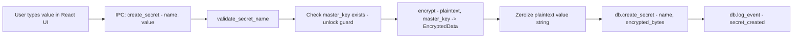
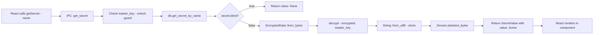
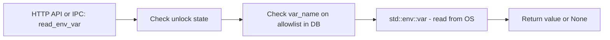
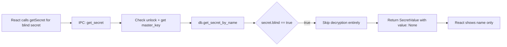
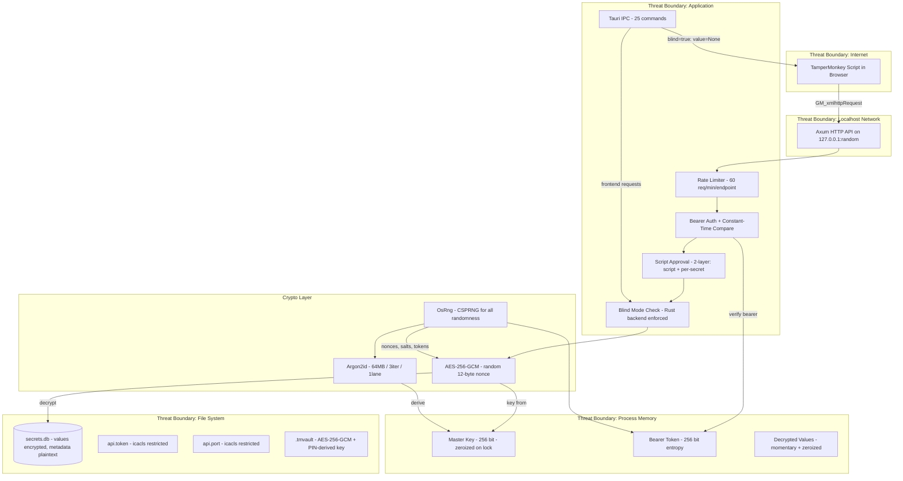

# TamperMonkey Secret Manager -- Security Review (Phase 7)

**Document Version**: 1.0  
**Date**: 2026-03-12  
**Scope**: Full STRIDE threat analysis, attack surface enumeration, data flow review, and residual risk assessment for all implemented components (Phases 1-6).

---

## Table of Contents

1. [STRIDE Threat Analysis](#1-stride-threat-analysis)
2. [Attack Surface Enumeration](#2-attack-surface-enumeration)
3. [Data Flow Analysis](#3-data-flow-analysis)
4. [Blind Mode Bypass Audit](#4-blind-mode-bypass-audit)
5. [Dependency Audit](#5-dependency-audit)
6. [Residual Risk Register](#6-residual-risk-register)
7. [Incident Response Playbook](#7-incident-response-playbook)
8. [Recommendations for Future Improvement](#8-recommendations-for-future-improvement)

---

## 1. STRIDE Threat Analysis

### 1.1 Tauri IPC Layer (Frontend <-> Rust Backend)

| STRIDE Category | Threat | Current Mitigation | Status | Notes |
|---|---|---|---|---|
| **S**poofing | Malicious web content in webview invokes IPC commands | Tauri v2 capabilities restrict which commands are callable; CSP restricts script sources to `'self'` | Mitigated | Capabilities in [`default.json`](../src-tauri/capabilities/default.json) grant `core:default`, `opener:default`, `dialog:default` only |
| **T**ampering | Attacker modifies IPC request payloads in transit | IPC is in-process via Tauri bridge -- no network transport to intercept | Mitigated | Commands validate inputs (e.g., [`validate_secret_name()`](../src-tauri/src/api/routes.rs:59) enforces character allowlist) |
| **R**epudiation | User denies performing an action (create/delete secret) | Audit log records all security-relevant events with timestamps via [`log_event()`](../src-tauri/src/db/mod.rs:236) | Mitigated | Audit log is append-only in SQLite; no mechanism to delete individual entries |
| **I**nformation Disclosure | Blind secret values leak to frontend via IPC | [`get_secret`](../src-tauri/src/commands.rs:357) returns `value: None` when `secret.blind == true`; [`list_secrets`](../src-tauri/src/commands.rs:416) never decrypts values | Mitigated | See Section 4 for full blind mode audit |
| **D**enial of Service | Frontend floods IPC with rapid commands causing mutex contention | No IPC-level rate limiting; Mutex locks are short-lived | Residual | Low risk -- attacker would need code execution in webview |
| **E**levation of Privilege | Webview JS calls commands that bypass app lock state | All secret-access commands check `master_key.is_none()` and return error if locked | Mitigated | Commands like [`create_secret`](../src-tauri/src/commands.rs:313), [`get_secret`](../src-tauri/src/commands.rs:357), [`update_secret`](../src-tauri/src/commands.rs:454) all verify unlock state |

### 1.2 Local HTTP API (TamperMonkey <-> Axum)

| STRIDE Category | Threat | Current Mitigation | Status | Notes |
|---|---|---|---|---|
| **S**poofing | Unauthorized process sends requests pretending to be a TamperMonkey script | Bearer token auth required on all endpoints except `/api/health`; constant-time comparison via [`constant_time_eq()`](../src-tauri/src/api/auth.rs:121) | Mitigated | Token is 32 bytes of OsRng randomness, base64url-encoded (256 bits of entropy) |
| **T**ampering | Man-in-the-middle modifies HTTP requests/responses on localhost | Binding is `127.0.0.1` only via [`SocketAddr::from(([127, 0, 0, 1], 0u16))`](../src-tauri/src/api/server.rs:84); no external network exposure | Accepted | Local proxy tools could intercept loopback; HTTPS would mitigate but adds complexity |
| **R**epudiation | Script accesses secret but denies it | Audit log records `secret_accessed_via_api` with `script_id` and `secret_name` per [`get_secret_api`](../src-tauri/src/api/routes.rs:228) | Mitigated | Script ID is self-reported -- a malicious script could provide a false ID |
| **I**nformation Disclosure | API response leaks secret to caches or logs | No-cache headers set: `Cache-Control: no-store, no-cache, must-revalidate`, `Pragma: no-cache`, `X-Content-Type-Options: nosniff` per [`get_secret_api`](../src-tauri/src/api/routes.rs:234); plaintext zeroized after response built | Mitigated | Response body is plaintext string -- minimal surface |
| **D**enial of Service | Attacker floods API endpoints to exhaust resources | Rate limiter at 60 req/min/endpoint via [`RateLimiter::new(60, 60)`](../src-tauri/src/api/server.rs:68); returns HTTP 429 when exceeded | Mitigated | Rate limit is per-endpoint path, not per-IP; sufficient for localhost threat model |
| **E**levation of Privilege | Unapproved script accesses secrets by guessing names | Two-layer check: script must be approved AND have per-secret access granted; unapproved scripts get HTTP 403; unknown scripts auto-register as unapproved | Mitigated | Per-secret access control in [`get_secret_api`](../src-tauri/src/api/routes.rs:166) |

### 1.3 Cryptographic Operations (AES-256-GCM, Argon2id)

| STRIDE Category | Threat | Current Mitigation | Status | Notes |
|---|---|---|---|---|
| **S**poofing | N/A -- crypto does not authenticate identities | N/A | N/A | Authentication is handled at API/IPC layer |
| **T**ampering | Ciphertext modified to alter decrypted value | AES-256-GCM provides authenticated encryption -- any tampering causes decryption failure | Mitigated | GCM auth tag is 16 bytes; integrity verified on every decrypt |
| **R**epudiation | N/A -- crypto operations are not user-facing actions | N/A | N/A | |
| **I**nformation Disclosure | Weak key derivation allows brute-force of master password | Argon2id with 64MB memory / 3 iterations / 1 lane via [`kdf::derive_key()`](../src-tauri/src/crypto/kdf.rs:21); 16-byte random salt per key | Mitigated | Parameters are reasonable for desktop; OWASP recommends minimum 19MB for Argon2id |
| **I**nformation Disclosure | Nonce reuse leaks plaintext relationships | Random 12-byte nonce via OsRng per encryption in [`encrypt()`](../src-tauri/src/crypto/encryption.rs:50); collision probability ~2^-48 per key | Mitigated | Probability of collision is negligible for expected usage patterns |
| **D**enial of Service | Expensive Argon2id computation blocks the app | KDF runs on async Tauri runtime; 64MB/3iter completes in ~200-500ms on modern hardware | Accepted | Single-user desktop app; not a practical concern |
| **E**levation of Privilege | N/A | N/A | N/A | |

### 1.4 SQLite Database

| STRIDE Category | Threat | Current Mitigation | Status | Notes |
|---|---|---|---|---|
| **S**poofing | N/A -- database has no authentication layer | N/A | N/A | Access control is at OS file permission level |
| **T**ampering | Attacker modifies secrets.db directly on disk | File permissions hardened via [`harden_db_permissions()`](../src-tauri/src/api/auth.rs:102) using icacls; WAL journal mode enabled; foreign keys enforced | Partially Mitigated | Local admin can bypass user-level ACLs; no integrity checksums on DB file |
| **R**epudiation | Audit log entries deleted or modified | Audit log table is append-only by application logic; no DELETE operations exposed for audit_log | Mitigated | Direct DB access could still modify; consider signed audit entries for higher assurance |
| **I**nformation Disclosure | Database file read by unauthorized user reveals secrets | Secret values are individually encrypted with AES-256-GCM before storage; metadata (names, types, timestamps) is plaintext in DB | Partially Mitigated | Secret names, script registrations, and audit log are readable without the master key |
| **D**enial of Service | Database file corruption prevents app from functioning | WAL journal mode provides crash recovery; `CREATE TABLE IF NOT EXISTS` makes migrations idempotent per [`migrate_v1()`](../src-tauri/src/db/migrations.rs:41) | Mitigated | Standard SQLite resilience |
| **E**levation of Privilege | SQL injection via user-controlled inputs | All queries use parameterized statements (`params![]` macro) throughout [`db/mod.rs`](../src-tauri/src/db/mod.rs); no string concatenation in SQL | Mitigated | rusqlite enforces parameterized queries |

### 1.5 .tmvault File Format

| STRIDE Category | Threat | Current Mitigation | Status | Notes |
|---|---|---|---|---|
| **S**poofing | Attacker creates a fake .tmvault file to inject secrets | Magic bytes `TMVT` and version byte validated on import per [`import_vault()`](../src-tauri/src/secrets/vault.rs:82); secret count cross-checked against actual payload | Partially Mitigated | No digital signature -- authenticity relies on out-of-band trust |
| **T**ampering | Attacker modifies encrypted payload in vault file | AES-256-GCM auth tag prevents undetected tampering; any modification causes decryption failure | Mitigated | |
| **R**epudiation | Vault creator denies creating the vault | No signing or attribution mechanism in vault format | Residual | Could add creator metadata or digital signatures in future versions |
| **I**nformation Disclosure | Leaked vault file exposes secrets | Payload encrypted with AES-256-GCM; key derived from PIN via Argon2id (64MB/3iter) per [`export_vault()`](../src-tauri/src/secrets/vault.rs:40) | Partially Mitigated | Weak PINs reduce security; secret count is visible in header bytes 21-24 |
| **D**enial of Service | Malformed vault file crashes the app | Input validation checks minimum size, magic bytes, version, empty payload per [`import_vault()`](../src-tauri/src/secrets/vault.rs:93); errors return Result::Err, no panics | Mitigated | |
| **E**levation of Privilege | Importing vault file with blind=false overrides blind flag | [`export_vault_file`](../src-tauri/src/commands.rs:658) uses `mark_blind \|\| entry.blind` -- exported secrets preserve blind flag from source; import respects blind field from vault | Mitigated | Vault creator controls blind flag; this is by design |

### 1.6 File System Artifacts (api.token, api.port, secrets.db)

| STRIDE Category | Threat | Current Mitigation | Status | Notes |
|---|---|---|---|---|
| **S**poofing | Attacker replaces api.token file with known token | File permissions set via icacls to current user read-only per [`set_owner_only_permissions()`](../src-tauri/src/api/auth.rs:74); token regenerated every app launch | Mitigated | Token on disk is only for TamperMonkey scripts to read; app uses in-memory token |
| **T**ampering | Attacker modifies api.port to redirect scripts to malicious server | Port file set read-only via icacls; scripts can verify they connect to 127.0.0.1 | Partially Mitigated | If attacker can write to port file AND create a local server, they could intercept |
| **R**epudiation | N/A | N/A | N/A | |
| **I**nformation Disclosure | api.token read by malware grants API access | icacls restricts to current user via [`set_owner_only_permissions()`](../src-tauri/src/api/auth.rs:74); file is read-only | Partially Mitigated | Admin/SYSTEM can bypass; malware running as current user has same access |
| **D**enial of Service | Attacker deletes token/port files preventing script communication | Files recreated on every app launch in [`start_api_server()`](../src-tauri/src/api/server.rs:26); app restart resolves | Mitigated | |
| **E**levation of Privilege | api.token grants full secret access without per-secret checks | Token only passes the auth gate; per-script approval and per-secret access still enforced in [`get_secret_api()`](../src-tauri/src/api/routes.rs:117) | Mitigated | Two-layer authorization model |

### 1.7 Master Password / Key Derivation

| STRIDE Category | Threat | Current Mitigation | Status | Notes |
|---|---|---|---|---|
| **S**poofing | Attacker guesses the master password | Argon2id KDF makes each guess expensive (~200-500ms); no lockout mechanism | Partially Mitigated | No password complexity enforcement; no failed-attempt lockout; failed attempts logged |
| **T**ampering | Attacker modifies stored salt/verification token to enable access with known password | Database file permissions restrict write access; verification token must decrypt to known plaintext `TAMPERMONKEY_SECRETS_VERIFIED` per [`VERIFICATION_PLAINTEXT`](../src-tauri/src/commands.rs:15) | Mitigated | Replacing salt+token would require knowing the attack password to create valid pair |
| **R**epudiation | N/A | N/A | N/A | |
| **I**nformation Disclosure | Master key persists in memory while unlocked | Key stored in `Mutex<Option<[u8; 32]>>` per [`AppState`](../src-tauri/src/state.rs:11); zeroized on lock via [`AppState::lock()`](../src-tauri/src/state.rs:43) | Accepted | Key must be in memory while unlocked by design; no auto-lock timer |
| **D**enial of Service | Repeated unlock attempts to slow the app | Each attempt costs ~200-500ms of Argon2id computation; no amplification | Accepted | Desktop app -- attacker has physical access anyway |
| **E**levation of Privilege | No password change flow -- compromised password cannot be rotated | Currently requires re-setup (delete DB and re-create) | Residual | Recommendation: add master password change feature |

### 1.8 Blind Mode Enforcement

| STRIDE Category | Threat | Current Mitigation | Status | Notes |
|---|---|---|---|---|
| **S**poofing | N/A | N/A | N/A | |
| **T**ampering | Attacker modifies blind flag in database to expose values | DB file permissions restrict write; blind flag is per-row in secrets table | Partially Mitigated | Local admin or current-user malware could modify DB |
| **R**epudiation | N/A | N/A | N/A | |
| **I**nformation Disclosure | Blind value leaks through IPC to frontend | [`get_secret`](../src-tauri/src/commands.rs:382) returns `None` for blind; [`list_secrets`](../src-tauri/src/commands.rs:416) never decrypts; [`update_secret`](../src-tauri/src/commands.rs:454) only accepts new values | Mitigated | See Section 4 for comprehensive audit |
| **D**enial of Service | N/A | N/A | N/A | |
| **E**levation of Privilege | User with frontend access circumvents blind mode through developer tools | Blind check is enforced in Rust backend, not frontend; webview devtools cannot bypass [`get_secret`](../src-tauri/src/commands.rs:382) returning None | Mitigated | Security boundary is at Rust IPC handler level |

### 1.9 Script Approval System

| STRIDE Category | Threat | Current Mitigation | Status | Notes |
|---|---|---|---|---|
| **S**poofing | Malicious script impersonates approved script by using same script_id | Bearer token is primary auth gate; script_id is trust-on-first-use; spoofing requires token compromise first | Accepted | Fundamental limitation -- TamperMonkey scripts self-report identity |
| **T**ampering | Attacker modifies approval status in database directly | DB file permissions restrict access; approval changes logged in audit | Partially Mitigated | |
| **R**epudiation | Script denies accessing a secret | Audit log records `secret_accessed_via_api` with script_id per [`get_secret_api`](../src-tauri/src/api/routes.rs:228); `script_auto_registered` logged on first contact | Mitigated | Script ID is self-reported but logged consistently |
| **I**nformation Disclosure | Unapproved script learns secret names from error messages | API returns generic HTTP status codes (403, 404) -- no secret names in error responses per [`get_secret_api`](../src-tauri/src/api/routes.rs:117) | Mitigated | |
| **D**enial of Service | Attacker floods registration endpoint to fill database with fake scripts | Rate limiting at 60 req/min; auto-registration creates minimal DB rows | Partially Mitigated | Over time, many fake registrations could accumulate |
| **E**levation of Privilege | Newly registered script gains automatic access | Scripts register as `approved: false` per [`register_script()`](../src-tauri/src/db/mod.rs:288); per-secret access defaults to unapproved via [`create_access_request()`](../src-tauri/src/db/mod.rs:494) | Mitigated | Explicit user approval required at both script and per-secret level |

---

## 2. Attack Surface Enumeration

### 2.1 IPC Commands (25 total)

All commands are registered in [`lib.rs`](../src-tauri/src/lib.rs:59) via `tauri::generate_handler![]`.

| # | Command | Parameters | Auth Required | Data Access | Blind-Safe |
|---|---------|-----------|---------------|-------------|------------|
| 1 | [`check_first_run`](../src-tauri/src/commands.rs:120) | none | No | Reads master_config existence | Yes |
| 2 | [`setup_master_password`](../src-tauri/src/commands.rs:135) | `password: String` | No (first run only) | Creates master_config; stores key in memory | Yes |
| 3 | [`unlock`](../src-tauri/src/commands.rs:201) | `password: String` | No | Reads master_config; stores key in memory | Yes |
| 4 | [`lock`](../src-tauri/src/commands.rs:272) | none | No | Zeroizes master key | Yes |
| 5 | [`get_app_status`](../src-tauri/src/commands.rs:285) | none | No | Reads is_unlocked + has_config | Yes |
| 6 | [`create_secret`](../src-tauri/src/commands.rs:313) | `name, value` | Unlock | Encrypts and stores secret | Yes |
| 7 | [`get_secret`](../src-tauri/src/commands.rs:357) | `name` | Unlock | Decrypts and returns value (None if blind) | **Yes -- blind returns None** |
| 8 | [`list_secrets`](../src-tauri/src/commands.rs:416) | none | Unlock | Returns metadata only, never values | Yes |
| 9 | [`update_secret`](../src-tauri/src/commands.rs:454) | `name, value` | Unlock | Re-encrypts with new value | Yes (write-only) |
| 10 | [`delete_secret`](../src-tauri/src/commands.rs:496) | `name` | Unlock | Deletes from DB | Yes |
| 11 | [`add_env_var_to_allowlist`](../src-tauri/src/commands.rs:532) | `var_name` | No* | Adds env var name to allowlist | Yes |
| 12 | [`remove_env_var_from_allowlist`](../src-tauri/src/commands.rs:555) | `var_name` | No* | Removes from allowlist | Yes |
| 13 | [`list_env_var_allowlist`](../src-tauri/src/commands.rs:577) | none | No* | Lists names + is_set status (no values) | Yes |
| 14 | [`read_env_var`](../src-tauri/src/commands.rs:606) | `var_name` | Unlock | Reads actual env var value if on allowlist | N/A (env vars) |
| 15 | [`export_vault_file`](../src-tauri/src/commands.rs:658) | `secret_names, pin, file_path, mark_blind` | Unlock | Decrypts secrets, re-encrypts with PIN | Yes (value in memory briefly) |
| 16 | [`import_vault_file`](../src-tauri/src/commands.rs:741) | `file_path, pin` | Unlock | Decrypts vault, re-encrypts with master key | Yes (blind flag preserved) |
| 17 | [`list_scripts_cmd`](../src-tauri/src/commands.rs:838) | none | No* | Lists script registrations | Yes |
| 18 | [`approve_script_cmd`](../src-tauri/src/commands.rs:864) | `script_id` | No* | Sets approved=true | Yes |
| 19 | [`revoke_script`](../src-tauri/src/commands.rs:884) | `script_id` | No* | Sets approved=false | Yes |
| 20 | [`delete_script_cmd`](../src-tauri/src/commands.rs:904) | `script_id` | No* | Deletes script + access records | Yes |
| 21 | [`list_script_access`](../src-tauri/src/commands.rs:924) | `script_id` | No* | Lists script-secret access pairs | Yes |
| 22 | [`set_script_secret_access`](../src-tauri/src/commands.rs:956) | `script_id, secret_name, approved` | No* | Creates/updates access record | Yes |
| 23 | [`get_audit_log`](../src-tauri/src/commands.rs:988) | `limit: Option<u32>` | No* | Reads audit entries (no secret values) | Yes |
| 24 | [`get_api_info`](../src-tauri/src/commands.rs:1021) | none | No* | Returns port + bearer token | Yes |
| 25 | [`rotate_api_token`](../src-tauri/src/commands.rs:1053) | none | No* | Generates new token, persists to disk + memory | Yes |

> *\*No* = command does not check `master_key.is_none()`. These are administrative commands that work regardless of lock state. The commands marked "No*" for env vars (#11-13) and scripts (#17-22) do not require unlock. This is by design -- managing the allowlist and approvals should be possible while locked.

**Finding**: Commands #11, #12, #17, #18, #19, #20, #22, #24, #25 do not verify the app is unlocked. This is intentional for administrative functions but means a compromised webview could modify script approvals or env var allowlists without the master password.

### 2.2 HTTP API Endpoints (3 total)

Defined in [`server.rs`](../src-tauri/src/api/server.rs:72):

| Method | Path | Auth | Rate Limited | Purpose |
|--------|------|------|-------------|---------|
| GET | `/api/health` | None | Yes (60/min) | Health check -- returns `{"status":"ok"}` |
| POST | `/api/secrets/{name}` | Bearer token | Yes (60/min) | Retrieve secret value; requires script approval + per-secret access |
| POST | `/api/register` | Bearer token | Yes (60/min) | Register a script; returns approval status |

**Security Headers on Secret Responses:**
- `Cache-Control: no-store, no-cache, must-revalidate`
- `Pragma: no-cache`
- `X-Content-Type-Options: nosniff`

**CORS**: `CorsLayer::permissive()` per [`server.rs`](../src-tauri/src/api/server.rs:76) -- this is necessary because TamperMonkey's `GM_xmlhttpRequest` bypasses browser CORS, but other localhost callers benefit from permissive CORS. Since the API is localhost-only with bearer auth, this is acceptable.

### 2.3 File System Artifacts

| File | Path | Permissions | Contains | Sensitivity |
|------|------|------------|----------|-------------|
| `api.token` | `{AppData}/tampermonkey-secrets/api.token` | icacls: current user read-only | 43-char base64url bearer token | **High** -- grants API access |
| `api.port` | `{AppData}/tampermonkey-secrets/api.port` | icacls: current user read-only | Port number (plaintext) | Low -- informational |
| `secrets.db` | `{AppData}/tampermonkey-secrets/secrets.db` | icacls: current user full control | Encrypted secrets, plaintext metadata, audit log | **High** -- contains encrypted secrets + plaintext metadata |
| `secrets.db-wal` | Same directory | Inherits parent | SQLite WAL journal | Medium -- may contain recent writes |
| `*.tmvault` | User-chosen path | OS default | AES-256-GCM encrypted secrets | **High** -- portable encrypted vault |

### 2.4 Process Memory

| Data | Lifetime | Zeroization | Risk |
|------|----------|-------------|------|
| Master key (`[u8; 32]`) | While unlocked | Zeroized on [`lock()`](../src-tauri/src/state.rs:43) via `zeroize` crate | Medium -- must persist for functionality |
| Decrypted secret values | Momentary (during command execution) | Zeroized after use in [`get_secret`](../src-tauri/src/commands.rs:395), [`create_secret`](../src-tauri/src/commands.rs:337), [`update_secret`](../src-tauri/src/commands.rs:476) | Low -- brief window |
| Bearer token | App lifetime | Zeroized on rotation in [`rotate_api_token`](../src-tauri/src/commands.rs:1067) | Medium -- required for API auth |
| Master password string | Brief (during setup/unlock) | Zeroized immediately after KDF in [`setup_master_password`](../src-tauri/src/commands.rs:146) and [`unlock`](../src-tauri/src/commands.rs:222) | Low -- very brief window |
| Vault PIN string | Brief (during export/import) | Zeroized after use in [`export_vault_file`](../src-tauri/src/commands.rs:721) and [`import_vault_file`](../src-tauri/src/commands.rs:768) | Low -- very brief window |
| Vault secret values | Brief (during export/import) | Zeroized per-secret in export loop per [`export_vault_file`](../src-tauri/src/commands.rs:712) and import loop per [`import_vault_file`](../src-tauri/src/commands.rs:821) | Low -- brief window |

---

## 3. Data Flow Analysis

### Flow 1: KV Secret Creation

**Plaintext locations:**
1. React component state -- until IPC call completes
2. Tauri IPC bridge -- serialized in transit (in-process)
3. `value` parameter in [`create_secret`](../src-tauri/src/commands.rs:313) -- until zeroized at line 337
4. Inside `encrypt()` -- briefly during AES-GCM operation

**Zeroization:** Password string zeroized at [`commands.rs:337`](../src-tauri/src/commands.rs:337). Decrypted bytes never exist in this flow.

### Flow 2: KV Secret Retrieval (UI -- non-blind)

**Plaintext locations:**
1. `plaintext_bytes` in [`get_secret`](../src-tauri/src/commands.rs:389) -- zeroized at line 395
2. `value` String -- returned to frontend (clone exists)
3. IPC serialized response -- in-process
4. React state / DOM -- until component unmounts

**Finding:** The `String::from_utf8(plaintext_bytes.clone())` at [`commands.rs:391`](../src-tauri/src/commands.rs:391) creates a clone of the bytes. The original `plaintext_bytes` is zeroized, but the `value` String derived from the clone is not zeroized before return. This is unavoidable since it must be sent to the frontend. **For non-blind secrets, this is by design.**

### Flow 3: KV Secret Retrieval (HTTP API)

```mermaid
graph LR
    A[TamperMonkey: POST /api/secrets/NAME] --> B[verify_bearer - constant-time]
    B --> C[validate_secret_name]
    C --> D[Check is_unlocked]
    D --> E[Check script approved]
    E --> F[Check per-secret access approved]
    F --> G[Get master_key]
    G --> H[db.get_secret_by_name]
    H --> I[decrypt]
    I --> J[String::from_utf8]
    J --> K[Log: secret_accessed_via_api]
    K --> L[Set no-cache headers]
    L --> M[Clone plaintext to response_body]
    M --> N[Zeroize plaintext]
    N --> O[Return HTTP 200 with body]
```

**Plaintext locations:**
1. `plaintext` variable in [`get_secret_api`](../src-tauri/src/api/routes.rs:194) -- zeroized at line 241
2. `response_body` clone at line 238 -- passed to Axum response builder
3. Axum's internal buffers -- until TCP write completes
4. Loopback network -- in TCP segment on 127.0.0.1
5. TamperMonkey script's `responseText` -- in browser memory

**Note:** Blind secrets are served through this path by design -- the blind check only applies to IPC (frontend), not HTTP API.

### Flow 4: Environment Variable Read

**Plaintext locations:**
1. OS environment -- always present
2. Return value of `std::env::var()` -- in Rust String
3. IPC/HTTP response -- sent to caller

**Note:** Environment variable values are **never persisted** to disk. They exist only in process memory during the read operation. No zeroization is performed on env var strings -- this is acceptable as the value continues to exist in the OS environment regardless.

### Flow 5: Vault Export

```mermaid
graph LR
    A[User selects secrets + sets PIN] --> B[IPC: export_vault_file]
    B --> C[validate_pin - min 6 chars]
    C --> D[Get master_key]
    D --> E[For each secret: decrypt with master_key]
    E --> F[Build VaultSecret structs]
    F --> G[Zeroize decrypted bytes per secret]
    G --> H[vault::export_vault - secrets, pin]
    H --> I[Argon2id: derive key from PIN + random salt]
    I --> J[Serialize secrets to JSON]
    J --> K[Encrypt JSON with vault key]
    K --> L[Zeroize JSON bytes]
    L --> M[Build TMVT header + encrypted payload]
    M --> N[Zeroize PIN]
    N --> O[Write bytes to file_path]
```

**Plaintext locations:**
1. Each secret's decrypted bytes -- zeroized per-iteration at [`commands.rs:703`](../src-tauri/src/commands.rs:703)
2. `VaultSecret.value` strings -- zeroized per-iteration at [`commands.rs:712`](../src-tauri/src/commands.rs:712)
3. JSON serialized bytes in [`vault.rs:56`](../src-tauri/src/secrets/vault.rs:56) -- zeroized at line 64
4. PIN string -- zeroized at [`commands.rs:721`](../src-tauri/src/commands.rs:721)

**Finding:** In [`export_vault_file`](../src-tauri/src/commands.rs:705), `VaultSecret` structs are built with `value: value.clone()`, then `value` is zeroized. However, the `VaultSecret` struct's `value` field is consumed by `vault::export_vault()` which serializes it to JSON. The `VaultSecret` values inside the Vec are not individually zeroized after JSON serialization -- only the JSON bytes are. The Vec of `VaultSecret` structs goes out of scope and is dropped (not zeroized). This is a minor gap.

### Flow 6: Vault Import

```mermaid
graph LR
    A[User selects .tmvault + enters PIN] --> B[IPC: import_vault_file]
    B --> C[validate_pin]
    C --> D[Get master_key]
    D --> E[Read file bytes]
    E --> F[vault::import_vault - data, pin]
    F --> G[Validate magic + version + size]
    G --> H[Extract salt from header]
    H --> I[Argon2id: derive key from PIN + salt]
    I --> J[Decrypt payload]
    J --> K[Deserialize JSON to Vec of VaultSecret]
    K --> L[Zeroize decrypted bytes]
    L --> M[Zeroize PIN]
    M --> N[For each: encrypt value with master_key]
    N --> O[db.create_secret with blind flag]
    O --> P[Zeroize secret.value per iteration]
```

**Plaintext locations:**
1. Decrypted JSON payload in [`vault.rs:137`](../src-tauri/src/secrets/vault.rs:137) -- zeroized at line 144
2. Deserialized `VaultSecret.value` strings -- zeroized per-iteration at [`commands.rs:821`](../src-tauri/src/commands.rs:821)
3. PIN string -- zeroized at [`commands.rs:768`](../src-tauri/src/commands.rs:768)

### Flow 7: Blind Secret Retrieval (UI)

**Plaintext locations:** None. The encrypted value is never decrypted in this flow. The master key is loaded but unused.

---

## 4. Blind Mode Bypass Audit

This section audits every code path that could potentially expose a blind secret's value to the frontend.

### 4.1 IPC Command Audit

| Command | Blind-Safe? | Evidence |
|---------|-------------|----------|
| [`get_secret`](../src-tauri/src/commands.rs:357) | **Yes** | Line 382: `if secret.blind { None }` -- decryption is skipped entirely for blind secrets |
| [`list_secrets`](../src-tauri/src/commands.rs:416) | **Yes** | Returns `SecretMetadata` struct which has no `value` field -- never decrypts any values |
| [`update_secret`](../src-tauri/src/commands.rs:454) | **Yes** | Write-only -- accepts a new value but never returns the old value |
| [`delete_secret`](../src-tauri/src/commands.rs:496) | **Yes** | Deletes by name -- never decrypts or returns values |
| [`create_secret`](../src-tauri/src/commands.rs:313) | **Yes** | Write-only -- encrypts and stores; creates with `blind: false` by default |
| [`export_vault_file`](../src-tauri/src/commands.rs:658) | **Acceptable** | Decrypts blind secrets for re-encryption into vault file; value goes to disk (encrypted), never to frontend |
| [`import_vault_file`](../src-tauri/src/commands.rs:741) | **Yes** | Returns `ImportedSecretInfo` which contains `name, blind, success, error` -- no `value` field |
| [`read_env_var`](../src-tauri/src/commands.rs:606) | **N/A** | Env vars are not in the secrets table; no blind concept |
| [`get_api_info`](../src-tauri/src/commands.rs:1021) | **N/A** | Returns port + token, not secret values |
| [`get_audit_log`](../src-tauri/src/commands.rs:988) | **Yes** | Returns event_type, script_id, secret_name, timestamp -- never values |

### 4.2 HTTP API Audit

| Endpoint | Blind-Safe? | Evidence |
|----------|-------------|----------|
| [`get_secret_api`](../src-tauri/src/api/routes.rs:117) | **By Design** | Serves blind secret values to approved scripts -- this is the intended consumption path for blind secrets |
| [`register_script_api`](../src-tauri/src/api/routes.rs:249) | **Yes** | Returns approval status only |
| [`health`](../src-tauri/src/api/routes.rs:110) | **Yes** | Returns static JSON |

### 4.3 Logging Audit

| Log Location | Contains Values? | Evidence |
|---|---|---|
| Audit log DB table | **No** | [`log_event()`](../src-tauri/src/db/mod.rs:236) accepts `event_type, script_id, secret_name` -- no value parameter |
| `eprintln!` in server.rs | **No** | Only logs server errors at [`server.rs:109`](../src-tauri/src/api/server.rs:109) |
| `println!` in lib.rs | **No** | Only logs API port at [`lib.rs:52`](../src-tauri/src/lib.rs:52) |
| Error messages | **No** | All error types in [`error.rs`](../src-tauri/src/error.rs) contain descriptive strings, never secret values |
| `console.error` in frontend | **No** | Frontend JS only logs error messages, never secret values |

### 4.4 Conclusion

**Can blind mode be bypassed through any documented code path?**

**No.** Blind mode enforcement is correctly implemented:

1. The security boundary is at the Rust backend level -- the frontend cannot request blind values through any IPC command.
2. [`get_secret`](../src-tauri/src/commands.rs:382) checks `secret.blind` before decryption and returns `None`.
3. [`list_secrets`](../src-tauri/src/commands.rs:416) never decrypts any values.
4. No log statement, error message, or audit entry contains secret values.
5. The HTTP API serves blind values by design -- this is the intended path for TamperMonkey scripts.
6. Vault export necessarily decrypts blind values for re-encryption, but the plaintext only flows to the encrypted vault file, never to the frontend.

**Residual risk:** A user with access to the webview developer tools cannot extract blind values because the Rust backend never sends them. However, a user with access to the master password and local file system could read the encrypted DB and decrypt values offline using the same key derivation logic.

---

## 5. Dependency Audit

### 5.1 Rust Crates

Source: [`Cargo.toml`](../src-tauri/Cargo.toml)

| Crate | Version | Purpose | Security Notes |
|---|---|---|---|
| `aes-gcm` | 0.10 | AES-256-GCM authenticated encryption | RustCrypto project; widely reviewed; used by many production systems |
| `argon2` | 0.5 | Argon2id key derivation | RustCrypto project; implements the PHC winner |
| `rand` | 0.8 | Cryptographic randomness | Uses `OsRng` (CSPRNG backed by OS entropy); well-audited |
| `rusqlite` | 0.32 | SQLite database | `bundled` feature compiles SQLite from source (avoids system lib issues) |
| `zeroize` | 1.x | Secure memory wiping | RustCrypto project; uses volatile writes to prevent compiler optimization |
| `axum` | 0.8 | HTTP server | Tokio project; well-maintained, production-grade |
| `tower-http` | 0.6 | CORS middleware | Tokio project; used with `cors` feature only |
| `tokio` | 1.x | Async runtime | `full` feature enables all sub-crates; industry standard |
| `serde` | 1.x | Serialization | `derive` feature; no security implications |
| `serde_json` | 1.x | JSON parsing | No security implications for this use case |
| `thiserror` | 2.x | Error type derivation | Compile-time only; no security implications |
| `base64` | 0.22 | Token encoding | No security implications |
| `chrono` | 0.4 | Timestamps | `serde` feature; no security implications |
| `tauri` | 2.x | Desktop framework | Well-maintained; security-focused architecture |
| `tauri-plugin-opener` | 2.x | URL/file opening | Official Tauri plugin |
| `tauri-plugin-dialog` | 2.x | File dialogs | Official Tauri plugin |

**RustCrypto supply chain:** `aes-gcm`, `argon2`, `rand`, and `zeroize` are all part of the RustCrypto project, which follows best practices for cryptographic library development. No formal audit certificates are available, but the libraries are widely used and community-reviewed.

### 5.2 npm Packages

Source: [`package.json`](../package.json)

| Package | Version | Purpose | Security Notes |
|---|---|---|---|
| `react` | ^19.1.0 | UI framework | Meta/community maintained |
| `react-dom` | ^19.1.0 | DOM rendering | Meta/community maintained |
| `zustand` | ^5.0.11 | State management | Minimal footprint; no network access |
| `lucide-react` | ^0.577.0 | Icon library | SVG icons; no security implications |
| `tailwindcss` | ^4.2.1 | CSS framework | Build-time only; not in production bundle |
| `@tailwindcss/vite` | ^4.2.1 | Vite plugin for Tailwind | Build-time only |
| `@tauri-apps/api` | ^2 | Tauri IPC bridge | Official Tauri package |
| `@tauri-apps/plugin-dialog` | ^2.6.0 | File dialog bindings | Official Tauri plugin |
| `@tauri-apps/plugin-opener` | ^2 | URL/file opener | Official Tauri plugin |

**Dev dependencies** (`typescript`, `vite`, `@vitejs/plugin-react`, `@tauri-apps/cli`, type packages) are build-time only and do not ship in the production binary.

### 5.3 Recommendations

1. Run `cargo audit` regularly to check for known CVEs in Rust dependencies
2. Run `npm audit` regularly to check for known CVEs in npm dependencies
3. Pin exact versions in `Cargo.toml` (currently using semver ranges) for reproducible builds
4. Verify `Cargo.lock` and `package-lock.json` are committed to version control (both are present)
5. Consider enabling `cargo-vet` for supply chain verification of new dependencies

---

## 6. Residual Risk Register

| # | Risk | Severity | Likelihood | Mitigation Status | Accepted? | Notes |
|---|---|---|---|---|---|---|
| 1 | Local admin reads api.token file | Medium | Low | icacls restricts to current user | Yes | Admin/SYSTEM can bypass any user-level ACL; inherent OS limitation |
| 2 | Malware reads process memory while unlocked | High | Low | Master key zeroized on lock; secret values zeroized after use | Yes | Sophisticated malware can dump memory windows; no auto-lock timer compounds this |
| 3 | Weak master password chosen by user | High | Medium | No complexity enforcement currently | Accepted with recommendation | Add password strength meter (zxcvbn or entropy check) |
| 4 | Weak vault PIN enables brute force of .tmvault | Medium | Medium | Minimum 6 characters enforced in [`validate_pin`](../src-tauri/src/commands.rs:105) | Partially Mitigated | 6 chars is low; consider requiring mixed character classes |
| 5 | Script ID spoofing in API requests | Medium | Low | Bearer token is primary gate; script_id is secondary | Accepted | Spoofing only works if token is already compromised; fundamental TamperMonkey limitation |
| 6 | Bearer token visible in TamperMonkey script source | Medium | Medium | Token shown in Settings for user to copy; rotates on restart | Accepted | TamperMonkey scripts are stored as plain text in browser; fundamental limitation |
| 7 | HTTP API on localhost intercepted by local proxy | Low | Very Low | `127.0.0.1` binding; no external exposure; bearer auth required | Accepted | Local proxy tools (Fiddler, mitmproxy) could intercept; HTTPS would mitigate |
| 8 | AES-GCM nonce reuse leads to key recovery | Critical | Negligible | Random 12-byte nonce via OsRng per encryption in [`encrypt()`](../src-tauri/src/crypto/encryption.rs:50) | Mitigated | Birthday bound collision ~2^-48 per key; negligible for expected usage |
| 9 | Argon2id parameters insufficient for future hardware | Low | Low | 64MB/3iter/1lane is reasonable for 2026 per [`kdf.rs`](../src-tauri/src/crypto/kdf.rs:12) | Accepted | OWASP minimum is 19MB; current params exceed; can increase later |
| 10 | SQLite database structure visible without master key | Medium | Low | Secret values encrypted; names, types, timestamps, scripts, audit log in plaintext | Accepted | Consider SQLCipher for full DB encryption; current model protects values only |
| 11 | No master password change feature | Medium | Low | Requires deleting DB and re-creating all secrets | Residual | Critical UX gap; should be addressed in future release |
| 12 | No auto-lock timer | Medium | Medium | Manual lock only via UI button or app restart | Residual | User may leave app unlocked indefinitely; master key stays in memory |
| 13 | icacls-based permission uses USERNAME env var | Low | Low | [`set_owner_only_permissions`](../src-tauri/src/api/auth.rs:87) reads `%USERNAME%` which could be spoofed | Accepted | Windows-specific; native DACL APIs would be more robust |
| 14 | Permissive CORS on HTTP API | Low | Very Low | `CorsLayer::permissive()` in [`server.rs`](../src-tauri/src/api/server.rs:76) | Accepted | Bearer token is the real auth gate; CORS is defense-in-depth only; permissive needed for GM_xmlhttpRequest |
| 15 | VaultSecret values not individually zeroized after JSON serialization in export | Low | Negligible | Vec drops on function return; Rust deallocator does not zeroize | Accepted | Minor gap; values are in memory briefly during export only |
| 16 | Frontend Zustand stores hold non-blind secret values in JS memory | Medium | Low | Only populated when user actively views a secret; cleared on component unmount | Accepted | Inherent to showing values in UI; blind mode prevents this for sensitive secrets |
| 17 | `get_secret` clones plaintext bytes before zeroizing originals | Low | Negligible | [`commands.rs:391`](../src-tauri/src/commands.rs:391): `String::from_utf8(plaintext_bytes.clone())` | Accepted | Clone is necessary to create the String; original bytes zeroized; String must be sent to frontend |
| 18 | No failed unlock attempt lockout | Medium | Low | Failed attempts logged; Argon2id makes each attempt ~200-500ms | Accepted | Physical access scenario; attacker with device can attempt indefinitely at ~2-5/sec |
| 19 | Env var commands do not require unlock state | Low | Low | [`add_env_var_to_allowlist`](../src-tauri/src/commands.rs:532) works while locked | Accepted | Allowlist modification is administrative; actual values require unlock |
| 20 | Token file written before permissions applied | Low | Very Low | [`save_token`](../src-tauri/src/api/auth.rs:22): `fs::write` then `set_owner_only_permissions` | Accepted | Brief race window; file in user-owned AppData directory |

---

## 7. Incident Response Playbook

### Scenario 1: Bearer Token Compromised

**Detection:** User notices unauthorized entries in the audit log (e.g., `secret_accessed_via_api` events from unknown `script_id` values), or discovers their token file was read by malware.

**Response steps:**
1. Open Settings in the app UI
2. Click "Rotate Token" -- calls [`rotate_api_token`](../src-tauri/src/commands.rs:1053) which:
   - Generates new 256-bit random token
   - Updates shared Axum reference (immediate effect)
   - Updates on-disk `api.token` file
   - Logs `api_token_rotated` audit event
3. All existing TamperMonkey scripts will fail auth until updated with new token
4. Review audit log for unauthorized `secret_accessed_via_api` events
5. Identify and revoke any suspicious script registrations
6. If specific secrets were accessed, rotate those secret values
7. Investigate how the token was compromised (malware, file access, etc.)

### Scenario 2: .tmvault File Leaked

**Detection:** User discovers a `.tmvault` file was shared with unintended recipients or found on a public location.

**Assessment:**
- File is AES-256-GCM encrypted with Argon2id-derived key (64MB/3iter)
- Attacker needs the PIN to decrypt
- Header reveals: vault version and secret count (visible plaintext), but not secret names or values

**Response steps:**
1. Assess PIN strength -- if PIN was 6+ digits only, brute force may be feasible
2. Assume compromise if PIN was weak (all-numeric, common words, etc.)
3. Rotate ALL secrets that were included in the vault
4. If secrets were imported by recipients, notify them to re-import with new vault
5. Create a new vault file with a stronger PIN
6. Consider increasing minimum PIN length from 6 to 8+ characters

### Scenario 3: Master Password Compromised

**Detection:** User suspects their master password is known to an attacker (shoulder surfing, phishing, password reuse breach).

**Impact:** With the master password AND local file system access, attacker can:
- Decrypt all secrets in `secrets.db`
- Read the bearer token from memory or disk
- Access all secrets via HTTP API

**Response steps:**
1. Immediately lock the app if currently unlocked
2. **Current limitation:** No password change feature exists -- requires:
   a. Export all secrets to a vault file with a strong PIN
   b. Delete the `secrets.db` file
   c. Restart app -- will trigger first-run setup
   d. Set a new master password
   e. Re-import secrets from vault file
3. Rotate all secrets (API keys, passwords, tokens) stored in the app
4. Rotate the API bearer token
5. Review audit log for unauthorized access before lock
6. Investigate how the password was compromised

### Scenario 4: Dependency Vulnerability Discovered

**Detection:** `cargo audit` or `npm audit` reports a CVE in a dependency, or a security advisory is published.

**Triage:**
1. Determine if the vulnerable code path is reachable in this application
2. Assess severity: crypto crates (aes-gcm, argon2, rand) are critical; UI crates are lower risk

**Response steps:**
1. Run `cargo audit` to identify affected crate and version
2. Check if the vulnerability is exploitable in the app's usage pattern
3. Update the affected dependency in `Cargo.toml` / `package.json`
4. Run the full test suite (65 tests: 35 unit + 29 integration)
5. Rebuild the application
6. If a **crypto crate** is affected:
   - Assess whether existing encrypted data may be compromised
   - If encryption was weakened: re-encrypt all secrets with fixed library
   - Rotate all secrets as a precaution
7. If the **axum/tower-http** stack is affected:
   - Assess whether auth bypass was possible
   - Rotate bearer token
   - Review audit logs for suspicious access during vulnerable period
8. Deploy updated binary to users

### Scenario 5: secrets.db File Stolen

**Detection:** User discovers their `secrets.db` file was copied by malware or exfiltrated.

**Assessment:**
- Secret values are individually AES-256-GCM encrypted with master-key-derived key
- Attacker needs the master password to derive the key
- Metadata (secret names, types, timestamps, script registrations, audit log) is plaintext

**Response steps:**
1. Assess master password strength -- if strong, encrypted values are safe
2. Assume metadata (secret names, script IDs, domains) is compromised
3. If master password may be weak, assume all secrets compromised
4. Rotate all secrets stored in the application
5. Change master password (via re-setup flow)
6. Consider moving to SQLCipher for full database encryption

---

## 8. Recommendations for Future Improvement

Listed in priority order based on security impact:

| # | Recommendation | Addresses Risk | Impact |
|---|---|---|---|
| 1 | **Master password change flow** -- Add a command that re-derives a new key and re-encrypts all secrets without requiring DB deletion | Risk #11 | High -- critical for incident response |
| 2 | **Auto-lock timer** -- Lock the app after N minutes of inactivity; zeroize master key automatically | Risk #2, #12 | High -- reduces memory exposure window |
| 3 | **Password strength meter** -- Add zxcvbn or entropy check for master password during setup | Risk #3 | High -- prevents weak passwords at source |
| 4 | **SQLCipher integration** -- Replace rusqlite with SQLCipher for full database encryption at rest | Risk #10 | Medium -- protects metadata and audit log |
| 5 | **Windows DACL APIs** -- Replace icacls shell-out with native Win32 DACL via `windows-acl` crate | Risk #13, #20 | Medium -- eliminates race condition and env var dependency |
| 6 | **PIN complexity enforcement** -- Require mixed character classes (letters + digits) for vault PINs, increase minimum to 8 | Risk #4 | Medium -- strengthens vault file security |
| 7 | **Failed unlock attempt lockout** -- After N failed attempts, introduce exponential backoff delay | Risk #18 | Medium -- slows brute force on unlocked device |
| 8 | **HTTPS on localhost** -- Generate ephemeral self-signed certificate for optional HTTPS API | Risk #7 | Low -- defense-in-depth for localhost |
| 9 | **Clipboard auto-clear** -- If copy-to-clipboard features are used, auto-clear clipboard after 30 seconds | N/A (preventive) | Low -- prevents clipboard persistence |
| 10 | **Secure enclave integration** -- Investigate Windows DPAPI or TPM 2.0 for master key protection | Risk #2 | Medium -- OS-level key protection |
| 11 | **Audit log export** -- Allow exporting audit logs to external file for forensic review | Operational | Low -- useful for incident response |
| 12 | **Database integrity verification** -- Hash the secrets.db file on close and verify on startup | Risk #10 | Low -- detects offline tampering |
| 13 | **IPC rate limiting** -- Add rate limiting to IPC commands to prevent abuse from compromised webview | Risk from Section 1.1 DoS | Low -- defense-in-depth |
| 14 | **Vault file signatures** -- Add HMAC or digital signature to .tmvault files for authenticity verification | Risk from Section 1.5 Spoofing | Low -- enables origin verification |

---

## Appendix A: Security Architecture Summary

---

## Appendix B: Test Coverage Summary

| Category | Count | Covers |
|---|---|---|
| Crypto unit tests | 7 | Encrypt/decrypt roundtrip, wrong key, nonce uniqueness, serialization |
| KDF unit tests | 3 | Deterministic derivation, different salts, salt uniqueness |
| Auth unit tests | 5 | Token generation, uniqueness, constant-time eq, save/load |
| Rate limiter unit tests | 4 | Within limit, over limit, separate endpoints, window expiry |
| DB unit tests | 7 | Open, migrations, master config, secret CRUD, unique constraint, audit log, env vars |
| Vault unit tests | 7 | Roundtrip, wrong PIN, format, blind flag, short PIN, bad magic, empty vault |
| Script registration tests | 1 | Register, get, approve, duplicate, not found |
| Integration tests | 29+ | `crypto_integration.rs`, `vault_integration.rs`, `api_auth_test.rs` |
| **Total** | **~65** | |
